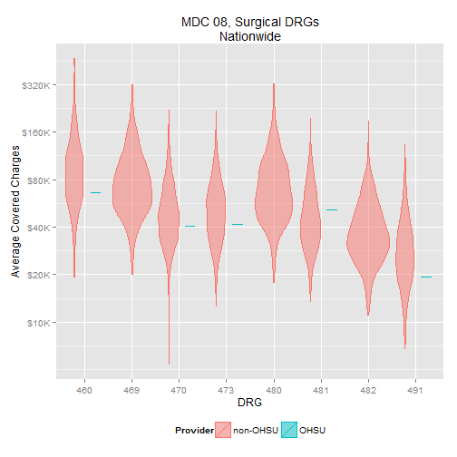

Medicare Provider Charge
========================

Last update by Benjamin Chan (<benjamin.ks.chan@gmail.com>) on 2013-05-09 15:39:24 using R version 3.0.0 (2013-04-03).

Analyze CMS Medicare Provider Charge public use dataset. The data is documented and can be downloaded at the Medicare Provider Charge Data [website](http://www.cms.gov/Research-Statistics-Data-and-Systems/Statistics-Trends-and-Reports/Medicare-Provider-Charge-Data/index.html).

> As part of the Obama administration’s work to make our health care system more affordable and accountable, data are being released that show significant variation across the country and within communities in what hospitals charge for common inpatient services.

> The data provided here include hospital-specific charges for the more than 3,000 U.S. hospitals that receive Medicare Inpatient Prospective Payment System (IPPS) payments for the top 100 most frequently billed discharges, paid under Medicare based on a rate per discharge using the Medicare Severity Diagnosis Related Group (MS-DRG) for Fiscal Year (FY) 2011. These DRGs represent almost 7 million discharges or 60 percent of total Medicare IPPS discharges.

> Hospitals determine what they will charge for items and services provided to patients and these charges are the amount the hospital bills for an item or service. The Total Payment amount includes the MS-DRG amount, bill total per diem, beneficiary primary payer claim payment amount, beneficiary Part A coinsurance amount, beneficiary deductible amount, beneficiary blood deducible amount and DRG outlier amount.

> For these DRGs, average charges and average Medicare payments are calculated at the individual hospital level. Users will be able to make comparisons between the amount charged by individual hospitals within local markets, and nationwide, for services that might be furnished in connection with a particular inpatient stay.

--------------------------------------------------------------------------------

Load the required libraries.

```r
require(RCurl, quietly = TRUE)
require(xtable, quietly = TRUE)
require(ggplot2, quietly = TRUE)
require(scales, quietly = TRUE)
require(RColorBrewer, quietly = TRUE)
```


RCurl with https is being tempermental. Copy the dataset to the local folder and `read.table` from there. Read the entire dataset. 

```r
# url <-
# getURL('https://dl.dropboxusercontent.com/u/386956/Medicare_Provider_Charge_Inpatient_DRG100_FY2011.csv')
# df <- read.csv(textConnection(url), header=TRUE, sep=',')
df <- read.csv("Medicare_Provider_Charge_Inpatient_DRG100_FY2011.csv", header = TRUE, 
    sep = ",")
```

Create some new fields.

```r
df$DRGnum <- as.numeric(substr(df$DRG.Definition, 1, 3))
df$DRGlab <- substr(df$DRG.Definition, 7, max(nchar(as.character(df$DRG.Definition))))
df$OHSU <- grepl("^OHSU", df$Provider.Name)
```

Show the number of rows, the field names, and the first few rows.

```r
nrow(df)
```

```
## [1] 163065
```

```r
names(df)
```

```
##  [1] "DRG.Definition"                      
##  [2] "Provider.Id"                         
##  [3] "Provider.Name"                       
##  [4] "Provider.Street.Address"             
##  [5] "Provider.City"                       
##  [6] "Provider.State"                      
##  [7] "Provider.Zip.Code"                   
##  [8] "Hospital.Referral.Region.Description"
##  [9] "Total.Discharges"                    
## [10] "Average.Covered.Charges"             
## [11] "Average.Total.Payments"              
## [12] "DRGnum"                              
## [13] "DRGlab"                              
## [14] "OHSU"
```

```r
head(df)
```

```
##                                                    DRG.Definition
## 1                        039 - EXTRACRANIAL PROCEDURES W/O CC/MCC
## 2             057 - DEGENERATIVE NERVOUS SYSTEM DISORDERS W/O MCC
## 3      064 - INTRACRANIAL HEMORRHAGE OR CEREBRAL INFARCTION W MCC
## 4       065 - INTRACRANIAL HEMORRHAGE OR CEREBRAL INFARCTION W CC
## 5 066 - INTRACRANIAL HEMORRHAGE OR CEREBRAL INFARCTION W/O CC/MCC
## 6                                        069 - TRANSIENT ISCHEMIA
##   Provider.Id                    Provider.Name Provider.Street.Address
## 1       10001 SOUTHEAST ALABAMA MEDICAL CENTER  1108 ROSS CLARK CIRCLE
## 2       10001 SOUTHEAST ALABAMA MEDICAL CENTER  1108 ROSS CLARK CIRCLE
## 3       10001 SOUTHEAST ALABAMA MEDICAL CENTER  1108 ROSS CLARK CIRCLE
## 4       10001 SOUTHEAST ALABAMA MEDICAL CENTER  1108 ROSS CLARK CIRCLE
## 5       10001 SOUTHEAST ALABAMA MEDICAL CENTER  1108 ROSS CLARK CIRCLE
## 6       10001 SOUTHEAST ALABAMA MEDICAL CENTER  1108 ROSS CLARK CIRCLE
##   Provider.City Provider.State Provider.Zip.Code
## 1        DOTHAN             AL             36301
## 2        DOTHAN             AL             36301
## 3        DOTHAN             AL             36301
## 4        DOTHAN             AL             36301
## 5        DOTHAN             AL             36301
## 6        DOTHAN             AL             36301
##   Hospital.Referral.Region.Description Total.Discharges
## 1                          AL - Dothan               91
## 2                          AL - Dothan               38
## 3                          AL - Dothan               84
## 4                          AL - Dothan              169
## 5                          AL - Dothan               33
## 6                          AL - Dothan               37
##   Average.Covered.Charges Average.Total.Payments DRGnum
## 1                   32963                   5777     39
## 2                   20313                   4895     57
## 3                   38820                  10260     64
## 4                   27345                   6542     65
## 5                   17606                   4596     66
## 6                   20689                   4134     69
##                                                      DRGlab  OHSU
## 1                        EXTRACRANIAL PROCEDURES W/O CC/MCC FALSE
## 2             DEGENERATIVE NERVOUS SYSTEM DISORDERS W/O MCC FALSE
## 3      INTRACRANIAL HEMORRHAGE OR CEREBRAL INFARCTION W MCC FALSE
## 4       INTRACRANIAL HEMORRHAGE OR CEREBRAL INFARCTION W CC FALSE
## 5 INTRACRANIAL HEMORRHAGE OR CEREBRAL INFARCTION W/O CC/MCC FALSE
## 6                                        TRANSIENT ISCHEMIA FALSE
```


Create geographic subsets of
* Oregon providers
* Portland metro providers
* OHSU

```r
dfOR <- subset(df, Provider.State == "OR")
dfPDXMetro <- df[grep("^OR - Portland", df$Hospital.Referral.Region.Description), 
    ]
dfOHSU <- df[grep("^OHSU", df$Provider.Name), ]
```

Not all DRGs are in the dataset. List the DRGs that are reported for OHSU. DRGs with a *1* to the right are those reported for OHSU

```r
print(xtable(table(dfOHSU$DRG.Definition)), type = "html")
```

<!-- html table generated in R 3.0.0 by xtable 1.7-1 package -->
<!-- Thu May 09 15:39:30 2013 -->
<TABLE border=1>
<TR> <TH>  </TH> <TH> V1 </TH>  </TR>
  <TR> <TD align="right"> 039 - EXTRACRANIAL PROCEDURES W/O CC/MCC </TD> <TD align="right">   0 </TD> </TR>
  <TR> <TD align="right"> 057 - DEGENERATIVE NERVOUS SYSTEM DISORDERS W/O MCC </TD> <TD align="right">   1 </TD> </TR>
  <TR> <TD align="right"> 064 - INTRACRANIAL HEMORRHAGE OR CEREBRAL INFARCTION W MCC </TD> <TD align="right">   1 </TD> </TR>
  <TR> <TD align="right"> 065 - INTRACRANIAL HEMORRHAGE OR CEREBRAL INFARCTION W CC </TD> <TD align="right">   1 </TD> </TR>
  <TR> <TD align="right"> 066 - INTRACRANIAL HEMORRHAGE OR CEREBRAL INFARCTION W/O CC/MCC </TD> <TD align="right">   1 </TD> </TR>
  <TR> <TD align="right"> 069 - TRANSIENT ISCHEMIA </TD> <TD align="right">   1 </TD> </TR>
  <TR> <TD align="right"> 074 - CRANIAL &amp  PERIPHERAL NERVE DISORDERS W/O MCC </TD> <TD align="right">   0 </TD> </TR>
  <TR> <TD align="right"> 101 - SEIZURES W/O MCC </TD> <TD align="right">   1 </TD> </TR>
  <TR> <TD align="right"> 149 - DYSEQUILIBRIUM </TD> <TD align="right">   0 </TD> </TR>
  <TR> <TD align="right"> 176 - PULMONARY EMBOLISM W/O MCC </TD> <TD align="right">   0 </TD> </TR>
  <TR> <TD align="right"> 177 - RESPIRATORY INFECTIONS &amp  INFLAMMATIONS W MCC </TD> <TD align="right">   1 </TD> </TR>
  <TR> <TD align="right"> 178 - RESPIRATORY INFECTIONS &amp  INFLAMMATIONS W CC </TD> <TD align="right">   1 </TD> </TR>
  <TR> <TD align="right"> 189 - PULMONARY EDEMA &amp  RESPIRATORY FAILURE </TD> <TD align="right">   0 </TD> </TR>
  <TR> <TD align="right"> 190 - CHRONIC OBSTRUCTIVE PULMONARY DISEASE W MCC </TD> <TD align="right">   1 </TD> </TR>
  <TR> <TD align="right"> 191 - CHRONIC OBSTRUCTIVE PULMONARY DISEASE W CC </TD> <TD align="right">   1 </TD> </TR>
  <TR> <TD align="right"> 192 - CHRONIC OBSTRUCTIVE PULMONARY DISEASE W/O CC/MCC </TD> <TD align="right">   1 </TD> </TR>
  <TR> <TD align="right"> 193 - SIMPLE PNEUMONIA &amp  PLEURISY W MCC </TD> <TD align="right">   0 </TD> </TR>
  <TR> <TD align="right"> 194 - SIMPLE PNEUMONIA &amp  PLEURISY W CC </TD> <TD align="right">   1 </TD> </TR>
  <TR> <TD align="right"> 195 - SIMPLE PNEUMONIA &amp  PLEURISY W/O CC/MCC </TD> <TD align="right">   0 </TD> </TR>
  <TR> <TD align="right"> 202 - BRONCHITIS &amp  ASTHMA W CC/MCC </TD> <TD align="right">   0 </TD> </TR>
  <TR> <TD align="right"> 203 - BRONCHITIS &amp  ASTHMA W/O CC/MCC </TD> <TD align="right">   0 </TD> </TR>
  <TR> <TD align="right"> 207 - RESPIRATORY SYSTEM DIAGNOSIS W VENTILATOR SUPPORT 96+ HOURS </TD> <TD align="right">   0 </TD> </TR>
  <TR> <TD align="right"> 208 - RESPIRATORY SYSTEM DIAGNOSIS W VENTILATOR SUPPORT &lt 96 HOURS </TD> <TD align="right">   1 </TD> </TR>
  <TR> <TD align="right"> 238 - MAJOR CARDIOVASC PROCEDURES W/O MCC </TD> <TD align="right">   1 </TD> </TR>
  <TR> <TD align="right"> 243 - PERMANENT CARDIAC PACEMAKER IMPLANT W CC </TD> <TD align="right">   1 </TD> </TR>
  <TR> <TD align="right"> 244 - PERMANENT CARDIAC PACEMAKER IMPLANT W/O CC/MCC </TD> <TD align="right">   0 </TD> </TR>
  <TR> <TD align="right"> 246 - PERC CARDIOVASC PROC W DRUG-ELUTING STENT W MCC OR 4+ VESSELS/STENTS </TD> <TD align="right">   0 </TD> </TR>
  <TR> <TD align="right"> 247 - PERC CARDIOVASC PROC W DRUG-ELUTING STENT W/O MCC </TD> <TD align="right">   1 </TD> </TR>
  <TR> <TD align="right"> 249 - PERC CARDIOVASC PROC W NON-DRUG-ELUTING STENT W/O MCC </TD> <TD align="right">   1 </TD> </TR>
  <TR> <TD align="right"> 251 - PERC CARDIOVASC PROC W/O CORONARY ARTERY STENT W/O MCC </TD> <TD align="right">   1 </TD> </TR>
  <TR> <TD align="right"> 252 - OTHER VASCULAR PROCEDURES W MCC </TD> <TD align="right">   1 </TD> </TR>
  <TR> <TD align="right"> 253 - OTHER VASCULAR PROCEDURES W CC </TD> <TD align="right">   1 </TD> </TR>
  <TR> <TD align="right"> 254 - OTHER VASCULAR PROCEDURES W/O CC/MCC </TD> <TD align="right">   0 </TD> </TR>
  <TR> <TD align="right"> 280 - ACUTE MYOCARDIAL INFARCTION, DISCHARGED ALIVE W MCC </TD> <TD align="right">   1 </TD> </TR>
  <TR> <TD align="right"> 281 - ACUTE MYOCARDIAL INFARCTION, DISCHARGED ALIVE W CC </TD> <TD align="right">   1 </TD> </TR>
  <TR> <TD align="right"> 282 - ACUTE MYOCARDIAL INFARCTION, DISCHARGED ALIVE W/O CC/MCC </TD> <TD align="right">   1 </TD> </TR>
  <TR> <TD align="right"> 286 - CIRCULATORY DISORDERS EXCEPT AMI, W CARD CATH W MCC </TD> <TD align="right">   0 </TD> </TR>
  <TR> <TD align="right"> 287 - CIRCULATORY DISORDERS EXCEPT AMI, W CARD CATH W/O MCC </TD> <TD align="right">   1 </TD> </TR>
  <TR> <TD align="right"> 291 - HEART FAILURE &amp  SHOCK W MCC </TD> <TD align="right">   1 </TD> </TR>
  <TR> <TD align="right"> 292 - HEART FAILURE &amp  SHOCK W CC </TD> <TD align="right">   1 </TD> </TR>
  <TR> <TD align="right"> 293 - HEART FAILURE &amp  SHOCK W/O CC/MCC </TD> <TD align="right">   1 </TD> </TR>
  <TR> <TD align="right"> 300 - PERIPHERAL VASCULAR DISORDERS W CC </TD> <TD align="right">   1 </TD> </TR>
  <TR> <TD align="right"> 301 - PERIPHERAL VASCULAR DISORDERS W/O CC/MCC </TD> <TD align="right">   0 </TD> </TR>
  <TR> <TD align="right"> 303 - ATHEROSCLEROSIS W/O MCC </TD> <TD align="right">   0 </TD> </TR>
  <TR> <TD align="right"> 305 - HYPERTENSION W/O MCC </TD> <TD align="right">   0 </TD> </TR>
  <TR> <TD align="right"> 308 - CARDIAC ARRHYTHMIA &amp  CONDUCTION DISORDERS W MCC </TD> <TD align="right">   1 </TD> </TR>
  <TR> <TD align="right"> 309 - CARDIAC ARRHYTHMIA &amp  CONDUCTION DISORDERS W CC </TD> <TD align="right">   1 </TD> </TR>
  <TR> <TD align="right"> 310 - CARDIAC ARRHYTHMIA &amp  CONDUCTION DISORDERS W/O CC/MCC </TD> <TD align="right">   1 </TD> </TR>
  <TR> <TD align="right"> 312 - SYNCOPE &amp  COLLAPSE </TD> <TD align="right">   1 </TD> </TR>
  <TR> <TD align="right"> 313 - CHEST PAIN </TD> <TD align="right">   1 </TD> </TR>
  <TR> <TD align="right"> 314 - OTHER CIRCULATORY SYSTEM DIAGNOSES W MCC </TD> <TD align="right">   1 </TD> </TR>
  <TR> <TD align="right"> 315 - OTHER CIRCULATORY SYSTEM DIAGNOSES W CC </TD> <TD align="right">   1 </TD> </TR>
  <TR> <TD align="right"> 329 - MAJOR SMALL &amp  LARGE BOWEL PROCEDURES W MCC </TD> <TD align="right">   1 </TD> </TR>
  <TR> <TD align="right"> 330 - MAJOR SMALL &amp  LARGE BOWEL PROCEDURES W CC </TD> <TD align="right">   1 </TD> </TR>
  <TR> <TD align="right"> 372 - MAJOR GASTROINTESTINAL DISORDERS &amp  PERITONEAL INFECTIONS W CC </TD> <TD align="right">   1 </TD> </TR>
  <TR> <TD align="right"> 377 - G.I. HEMORRHAGE W MCC </TD> <TD align="right">   1 </TD> </TR>
  <TR> <TD align="right"> 378 - G.I. HEMORRHAGE W CC </TD> <TD align="right">   1 </TD> </TR>
  <TR> <TD align="right"> 379 - G.I. HEMORRHAGE W/O CC/MCC </TD> <TD align="right">   0 </TD> </TR>
  <TR> <TD align="right"> 389 - G.I. OBSTRUCTION W CC </TD> <TD align="right">   1 </TD> </TR>
  <TR> <TD align="right"> 390 - G.I. OBSTRUCTION W/O CC/MCC </TD> <TD align="right">   1 </TD> </TR>
  <TR> <TD align="right"> 391 - ESOPHAGITIS, GASTROENT &amp  MISC DIGEST DISORDERS W MCC </TD> <TD align="right">   1 </TD> </TR>
  <TR> <TD align="right"> 392 - ESOPHAGITIS, GASTROENT &amp  MISC DIGEST DISORDERS W/O MCC </TD> <TD align="right">   1 </TD> </TR>
  <TR> <TD align="right"> 394 - OTHER DIGESTIVE SYSTEM DIAGNOSES W CC </TD> <TD align="right">   1 </TD> </TR>
  <TR> <TD align="right"> 418 - LAPAROSCOPIC CHOLECYSTECTOMY W/O C.D.E. W CC </TD> <TD align="right">   0 </TD> </TR>
  <TR> <TD align="right"> 419 - LAPAROSCOPIC CHOLECYSTECTOMY W/O C.D.E. W/O CC/MCC </TD> <TD align="right">   0 </TD> </TR>
  <TR> <TD align="right"> 439 - DISORDERS OF PANCREAS EXCEPT MALIGNANCY W CC </TD> <TD align="right">   0 </TD> </TR>
  <TR> <TD align="right"> 460 - SPINAL FUSION EXCEPT CERVICAL W/O MCC </TD> <TD align="right">   1 </TD> </TR>
  <TR> <TD align="right"> 469 - MAJOR JOINT REPLACEMENT OR REATTACHMENT OF LOWER EXTREMITY W MCC </TD> <TD align="right">   0 </TD> </TR>
  <TR> <TD align="right"> 470 - MAJOR JOINT REPLACEMENT OR REATTACHMENT OF LOWER EXTREMITY W/O MCC </TD> <TD align="right">   1 </TD> </TR>
  <TR> <TD align="right"> 473 - CERVICAL SPINAL FUSION W/O CC/MCC </TD> <TD align="right">   1 </TD> </TR>
  <TR> <TD align="right"> 480 - HIP &amp  FEMUR PROCEDURES EXCEPT MAJOR JOINT W MCC </TD> <TD align="right">   0 </TD> </TR>
  <TR> <TD align="right"> 481 - HIP &amp  FEMUR PROCEDURES EXCEPT MAJOR JOINT W CC </TD> <TD align="right">   1 </TD> </TR>
  <TR> <TD align="right"> 482 - HIP &amp  FEMUR PROCEDURES EXCEPT MAJOR JOINT W/O CC/MCC </TD> <TD align="right">   0 </TD> </TR>
  <TR> <TD align="right"> 491 - BACK &amp  NECK PROC EXC SPINAL FUSION W/O CC/MCC </TD> <TD align="right">   1 </TD> </TR>
  <TR> <TD align="right"> 536 - FRACTURES OF HIP &amp  PELVIS W/O MCC </TD> <TD align="right">   0 </TD> </TR>
  <TR> <TD align="right"> 552 - MEDICAL BACK PROBLEMS W/O MCC </TD> <TD align="right">   1 </TD> </TR>
  <TR> <TD align="right"> 563 - FX, SPRN, STRN &amp  DISL EXCEPT FEMUR, HIP, PELVIS &amp  THIGH W/O MCC </TD> <TD align="right">   0 </TD> </TR>
  <TR> <TD align="right"> 602 - CELLULITIS W MCC </TD> <TD align="right">   0 </TD> </TR>
  <TR> <TD align="right"> 603 - CELLULITIS W/O MCC </TD> <TD align="right">   1 </TD> </TR>
  <TR> <TD align="right"> 638 - DIABETES W CC </TD> <TD align="right">   1 </TD> </TR>
  <TR> <TD align="right"> 640 - MISC DISORDERS OF NUTRITION,METABOLISM,FLUIDS/ELECTROLYTES W MCC </TD> <TD align="right">   1 </TD> </TR>
  <TR> <TD align="right"> 641 - MISC DISORDERS OF NUTRITION,METABOLISM,FLUIDS/ELECTROLYTES W/O MCC </TD> <TD align="right">   1 </TD> </TR>
  <TR> <TD align="right"> 682 - RENAL FAILURE W MCC </TD> <TD align="right">   1 </TD> </TR>
  <TR> <TD align="right"> 683 - RENAL FAILURE W CC </TD> <TD align="right">   1 </TD> </TR>
  <TR> <TD align="right"> 684 - RENAL FAILURE W/O CC/MCC </TD> <TD align="right">   1 </TD> </TR>
  <TR> <TD align="right"> 689 - KIDNEY &amp  URINARY TRACT INFECTIONS W MCC </TD> <TD align="right">   0 </TD> </TR>
  <TR> <TD align="right"> 690 - KIDNEY &amp  URINARY TRACT INFECTIONS W/O MCC </TD> <TD align="right">   1 </TD> </TR>
  <TR> <TD align="right"> 698 - OTHER KIDNEY &amp  URINARY TRACT DIAGNOSES W MCC </TD> <TD align="right">   0 </TD> </TR>
  <TR> <TD align="right"> 699 - OTHER KIDNEY &amp  URINARY TRACT DIAGNOSES W CC </TD> <TD align="right">   1 </TD> </TR>
  <TR> <TD align="right"> 811 - RED BLOOD CELL DISORDERS W MCC </TD> <TD align="right">   0 </TD> </TR>
  <TR> <TD align="right"> 812 - RED BLOOD CELL DISORDERS W/O MCC </TD> <TD align="right">   1 </TD> </TR>
  <TR> <TD align="right"> 853 - INFECTIOUS &amp  PARASITIC DISEASES W O.R. PROCEDURE W MCC </TD> <TD align="right">   1 </TD> </TR>
  <TR> <TD align="right"> 870 - SEPTICEMIA OR SEVERE SEPSIS W MV 96+ HOURS </TD> <TD align="right">   0 </TD> </TR>
  <TR> <TD align="right"> 871 - SEPTICEMIA OR SEVERE SEPSIS W/O MV 96+ HOURS W MCC </TD> <TD align="right">   1 </TD> </TR>
  <TR> <TD align="right"> 872 - SEPTICEMIA OR SEVERE SEPSIS W/O MV 96+ HOURS W/O MCC </TD> <TD align="right">   1 </TD> </TR>
  <TR> <TD align="right"> 885 - PSYCHOSES </TD> <TD align="right">   1 </TD> </TR>
  <TR> <TD align="right"> 897 - ALCOHOL/DRUG ABUSE OR DEPENDENCE W/O REHABILITATION THERAPY W/O MCC </TD> <TD align="right">   1 </TD> </TR>
  <TR> <TD align="right"> 917 - POISONING &amp  TOXIC EFFECTS OF DRUGS W MCC </TD> <TD align="right">   1 </TD> </TR>
  <TR> <TD align="right"> 918 - POISONING &amp  TOXIC EFFECTS OF DRUGS W/O MCC </TD> <TD align="right">   1 </TD> </TR>
  <TR> <TD align="right"> 948 - SIGNS &amp  SYMPTOMS W/O MCC </TD> <TD align="right">   1 </TD> </TR>
   </TABLE>


Create MDC subsets.

```r
dfMDC08S <- subset(df, 453 <= DRGnum & DRGnum <= 517)
```


MDC 08: Diseases and disorders of the musculoskeletal system and connective tissue
----------------------------------------------------------------------------------

### Surgical DRGs

Violin plots for the surgical DRGs in MDC 08.

```r
ggplot(dfMDC08S, aes(x = factor(DRGnum), y = Average.Covered.Charges, fill = OHSU, 
    color = OHSU)) + geom_violin(alpha = 1/2) + scale_y_log10(breaks = c(10000, 
    20000, 40000, 80000, 160000, 320000), labels = c("$10K", "$20K", "$40K", 
    "$80K", "$160K", "$320K")) + scale_fill_discrete("Provider", label = c("non-OHSU", 
    "OHSU")) + scale_color_discrete("Provider", label = c("non-OHSU", "OHSU")) + 
    labs(title = "MDC 08, Surgical DRGs\nNationwide", x = "DRG", y = "Average Covered Charges") + 
    theme(legend.position = "bottom")
```

 

