Medicare Provider Charge
========================

Last update by Benjamin Chan (<benjamin.ks.chan@gmail.com>) on `2013-05-26 21:27:19` using `R version 2.15.3 (2013-03-01)`.

Analyze CMS Medicare Provider Charge public use dataset. The data is documented and can be downloaded at the Medicare Provider Charge Data [website](http://www.cms.gov/Research-Statistics-Data-and-Systems/Statistics-Trends-and-Reports/Medicare-Provider-Charge-Data/index.html).

> As part of the Obama administration’s work to make our health care system more affordable and accountable, data are being released that show significant variation across the country and within communities in what hospitals charge for common inpatient services.

> The data provided here include hospital-specific charges for the more than 3,000 U.S. hospitals that receive Medicare Inpatient Prospective Payment System (IPPS) payments for the top 100 most frequently billed discharges, paid under Medicare based on a rate per discharge using the Medicare Severity Diagnosis Related Group (MS-DRG) for Fiscal Year (FY) 2011. These DRGs represent almost 7 million discharges or 60 percent of total Medicare IPPS discharges.

> Hospitals determine what they will charge for items and services provided to patients and these charges are the amount the hospital bills for an item or service. The Total Payment amount includes the MS-DRG amount, bill total per diem, beneficiary primary payer claim payment amount, beneficiary Part A coinsurance amount, beneficiary deductible amount, beneficiary blood deducible amount and DRG outlier amount.

> For these DRGs, average charges and average Medicare payments are calculated at the individual hospital level. Users will be able to make comparisons between the amount charged by individual hospitals within local markets, and nationwide, for services that might be furnished in connection with a particular inpatient stay.

--------------------------------------------------------------------------------

Reading and manipulating the data
---------------------------------

Load the required libraries.

```r
require(RCurl, quietly = TRUE)
require(xtable, quietly = TRUE)
require(ggplot2, quietly = TRUE)
require(scales, quietly = TRUE)
require(RColorBrewer, quietly = TRUE)
```


RCurl with https is being tempermental. Copy the dataset to the local folder and `read.table` from there. Read the entire dataset. 

```r
# url <-
# getURL('https://dl.dropboxusercontent.com/u/386956/Medicare_Provider_Charge_Inpatient_DRG100_FY2011.csv')
# df <- read.csv(textConnection(url), header=TRUE, sep=',')
df <- read.csv("Medicare_Provider_Charge_Inpatient_DRG100_FY2011.csv", header = TRUE, 
    sep = ",")
```


Create some new fields. 
* `DRGnum` is a numeric vector of the MS-DRG number without the description
* `DRGlab` is a character vector of the MS-DRG description without the number
* `OHSU` is a logical vector indicating if the row is from an OHSU provider

```r
df$DRGnum <- as.numeric(substr(df$DRG.Definition, 1, 3))
df$DRGlab <- substr(df$DRG.Definition, 7, max(nchar(as.character(df$DRG.Definition))))
df$OHSU <- grepl("^OHSU", df$Provider.Name)
```

Get vector of MS-DRGs that OHSU has data for.

```r
drgOHSU <- df$DRGnum[df$OHSU]
```


*TO-DO*

1. Create lookup table for MDC and DRG
2. Create MDC vector of MDC codes that OHSU has data for
3. Create working data subset that includes all providers from the MDCs in step 2.
4. Fix violin plots
  * Annotate with percentile
  * Flip coordinates?
  * Add `DRGlab` to axis tick labels?


Show the number of rows, the field names, and the first few rows.

```r
nrow(df)
```

```
## [1] 163065
```

```r
names(df)
```

```
##  [1] "DRG.Definition"                      
##  [2] "Provider.Id"                         
##  [3] "Provider.Name"                       
##  [4] "Provider.Street.Address"             
##  [5] "Provider.City"                       
##  [6] "Provider.State"                      
##  [7] "Provider.Zip.Code"                   
##  [8] "Hospital.Referral.Region.Description"
##  [9] "Total.Discharges"                    
## [10] "Average.Covered.Charges"             
## [11] "Average.Total.Payments"              
## [12] "DRGnum"                              
## [13] "DRGlab"                              
## [14] "OHSU"
```

```r
head(df)
```

```
##                                                    DRG.Definition
## 1                        039 - EXTRACRANIAL PROCEDURES W/O CC/MCC
## 2             057 - DEGENERATIVE NERVOUS SYSTEM DISORDERS W/O MCC
## 3      064 - INTRACRANIAL HEMORRHAGE OR CEREBRAL INFARCTION W MCC
## 4       065 - INTRACRANIAL HEMORRHAGE OR CEREBRAL INFARCTION W CC
## 5 066 - INTRACRANIAL HEMORRHAGE OR CEREBRAL INFARCTION W/O CC/MCC
## 6                                        069 - TRANSIENT ISCHEMIA
##   Provider.Id                    Provider.Name Provider.Street.Address
## 1       10001 SOUTHEAST ALABAMA MEDICAL CENTER  1108 ROSS CLARK CIRCLE
## 2       10001 SOUTHEAST ALABAMA MEDICAL CENTER  1108 ROSS CLARK CIRCLE
## 3       10001 SOUTHEAST ALABAMA MEDICAL CENTER  1108 ROSS CLARK CIRCLE
## 4       10001 SOUTHEAST ALABAMA MEDICAL CENTER  1108 ROSS CLARK CIRCLE
## 5       10001 SOUTHEAST ALABAMA MEDICAL CENTER  1108 ROSS CLARK CIRCLE
## 6       10001 SOUTHEAST ALABAMA MEDICAL CENTER  1108 ROSS CLARK CIRCLE
##   Provider.City Provider.State Provider.Zip.Code
## 1        DOTHAN             AL             36301
## 2        DOTHAN             AL             36301
## 3        DOTHAN             AL             36301
## 4        DOTHAN             AL             36301
## 5        DOTHAN             AL             36301
## 6        DOTHAN             AL             36301
##   Hospital.Referral.Region.Description Total.Discharges
## 1                          AL - Dothan               91
## 2                          AL - Dothan               38
## 3                          AL - Dothan               84
## 4                          AL - Dothan              169
## 5                          AL - Dothan               33
## 6                          AL - Dothan               37
##   Average.Covered.Charges Average.Total.Payments DRGnum
## 1                   32963                   5777     39
## 2                   20313                   4895     57
## 3                   38820                  10260     64
## 4                   27345                   6542     65
## 5                   17606                   4596     66
## 6                   20689                   4134     69
##                                                      DRGlab  OHSU
## 1                        EXTRACRANIAL PROCEDURES W/O CC/MCC FALSE
## 2             DEGENERATIVE NERVOUS SYSTEM DISORDERS W/O MCC FALSE
## 3      INTRACRANIAL HEMORRHAGE OR CEREBRAL INFARCTION W MCC FALSE
## 4       INTRACRANIAL HEMORRHAGE OR CEREBRAL INFARCTION W CC FALSE
## 5 INTRACRANIAL HEMORRHAGE OR CEREBRAL INFARCTION W/O CC/MCC FALSE
## 6                                        TRANSIENT ISCHEMIA FALSE
```


Create geographic subsets of
* Oregon providers
* Portland metro providers
* OHSU

```r
dfOR <- subset(df, Provider.State == "OR")
dfPDXMetro <- df[grep("^OR - Portland", df$Hospital.Referral.Region.Description), 
    ]
dfOHSU <- df[grep("^OHSU", df$Provider.Name), ]
```


Create MDC subsets.

```r
dfMDC01S <- subset(df, 20 <= DRGnum & DRGnum <= 42)
dfMDC01M <- subset(df, 52 <= DRGnum & DRGnum <= 103)
dfMDC02S <- subset(df, 113 <= DRGnum & DRGnum <= 117)
dfMDC02M <- subset(df, 121 <= DRGnum & DRGnum <= 125)
dfMDC03S <- subset(df, 129 <= DRGnum & DRGnum <= 139)
dfMDC03M <- subset(df, 146 <= DRGnum & DRGnum <= 159)
dfMDC04S <- subset(df, 163 <= DRGnum & DRGnum <= 168)
dfMDC04M <- subset(df, 175 <= DRGnum & DRGnum <= 206)
dfMDC05S <- subset(df, 215 <= DRGnum & DRGnum <= 265)
dfMDC05M <- subset(df, 280 <= DRGnum & DRGnum <= 316)
dfMDC06S <- subset(df, 326 <= DRGnum & DRGnum <= 358)
dfMDC06M <- subset(df, 368 <= DRGnum & DRGnum <= 395)
dfMDC07S <- subset(df, 405 <= DRGnum & DRGnum <= 425)
dfMDC07M <- subset(df, 432 <= DRGnum & DRGnum <= 446)
dfMDC08S <- subset(df, 453 <= DRGnum & DRGnum <= 517)
dfMDC08M <- subset(df, 533 <= DRGnum & DRGnum <= 566)
dfMDC09S <- subset(df, 570 <= DRGnum & DRGnum <= 585)
dfMDC09M <- subset(df, 592 <= DRGnum & DRGnum <= 607)
dfMDC10S <- subset(df, 614 <= DRGnum & DRGnum <= 630)
dfMDC10M <- subset(df, 637 <= DRGnum & DRGnum <= 645)
dfMDC11S <- subset(df, 652 <= DRGnum & DRGnum <= 675)
dfMDC11M <- subset(df, 682 <= DRGnum & DRGnum <= 700)
dfMDC12S <- subset(df, 707 <= DRGnum & DRGnum <= 718)
dfMDC12M <- subset(df, 722 <= DRGnum & DRGnum <= 730)
dfMDC13S <- subset(df, 734 <= DRGnum & DRGnum <= 750)
dfMDC13M <- subset(df, 754 <= DRGnum & DRGnum <= 761)
dfMDC14S <- subset(df, 765 <= DRGnum & DRGnum <= 770)
dfMDC14M <- subset(df, 774 <= DRGnum & DRGnum <= 782)
dfMDC15M <- subset(df, 789 <= DRGnum & DRGnum <= 795)
dfMDC16S <- subset(df, 799 <= DRGnum & DRGnum <= 804)
dfMDC16M <- subset(df, 808 <= DRGnum & DRGnum <= 816)
dfMDC17S <- subset(df, 820 <= DRGnum & DRGnum <= 830)
dfMDC17M <- subset(df, 834 <= DRGnum & DRGnum <= 849)
dfMDC18S <- subset(df, 856 <= DRGnum & DRGnum <= 855)
dfMDC18M <- subset(df, 862 <= DRGnum & DRGnum <= 872)
dfMDC19S <- subset(df, 876 == DRGnum)
dfMDC19M <- subset(df, 880 <= DRGnum & DRGnum <= 887)
dfMDC20M <- subset(df, 894 <= DRGnum & DRGnum <= 897)
dfMDC21S <- subset(df, 901 <= DRGnum & DRGnum <= 909)
dfMDC21M <- subset(df, 913 <= DRGnum & DRGnum <= 923)
dfMDC22S <- subset(df, 927 <= DRGnum & DRGnum <= 934)
dfMDC22S <- subset(df, 935 == DRGnum)
dfMDC23S <- subset(df, 939 <= DRGnum & DRGnum <= 941)
dfMDC23M <- subset(df, 945 <= DRGnum & DRGnum <= 951)
dfMDC24S <- subset(df, 955 <= DRGnum & DRGnum <= 959)
dfMDC24M <- subset(df, 963 <= DRGnum & DRGnum <= 965)
dfMDC25S <- subset(df, 969 <= DRGnum & DRGnum <= 970)
dfMDC25M <- subset(df, 974 <= DRGnum & DRGnum <= 977)
```

According to [findacode.com](http://www.findacode.com/code-set.php?set=DRG&mdc=04), DRGs 207 and 208 (respiratory system with ventilator support) are grouped as medical DRGs under MDC 04 (diseases & disorders of the respiratory system). This doesn't seem right. I'm going to exclude these DRGs until further clarification.
DRGs 998 (principal diagnosis invalid as discharge diagnosis) and 999 (ungroupable) are also excluded.

Create function for violin plotting.

```r
DistnPlot <- function(d, title) {
    drg <- d$DRGnum[d$OHSU]
    d.subset <- subset(d, DRGnum %in% drg, select = c(DRGnum, Average.Covered.Charges, 
        OHSU))
    ggplot(d.subset, aes(x = as.character(DRGnum), y = Average.Covered.Charges)) + 
        # geom_boxplot(alpha=1/2, outlier.size=0) +
    geom_violin(alpha = 1/2, fill = "grey") + geom_point(data = d.subset[d.subset$OHSU, 
        ]) + scale_y_log10(breaks = c(10000, 20000, 40000, 80000, 160000, 320000), 
        labels = c("$10", "$20", "$40", "$80", "$160", "$320")) + labs(title = paste(title, 
        "Nationwide", sep = "\n"), x = "DRG", y = "Average Covered Charges ($1,000s)") + 
        theme_bw() + theme(legend.position = "bottom", panel.grid.major.x = NULL, 
        panel.grid.major.y = element_line(color = "grey"), panel.grid.minor.y = NULL)
}
```


Surgical DRGs
-------------
Violin plots for surgical DRGs by MDC. Code chunks that are not evaluated do not have data. *NEED TO TWEAK THE FUNCTION TO CHECK THIS AND RETURN NULL*

```r
DistnPlot(dfMDC01S, "MDC 01 Diseases & disorders of the nervous system")
```

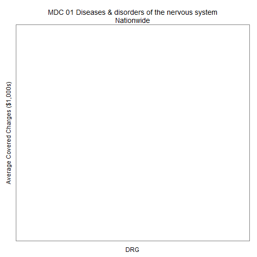 


```r
DistnPlot(dfMDC02S, "MDC 02 Diseases & disorders of the eye")
```


```r
DistnPlot(dfMDC03S, "MDC 03 Diseases & disorders of the ear, nose, mouth & throat")
```


```r
DistnPlot(dfMDC04S, "MDC 04 Diseases & disorders of the respiratory system")
```


```r
DistnPlot(dfMDC05S, "MDC 05 Diseases & disorders of the circulatory system")
```

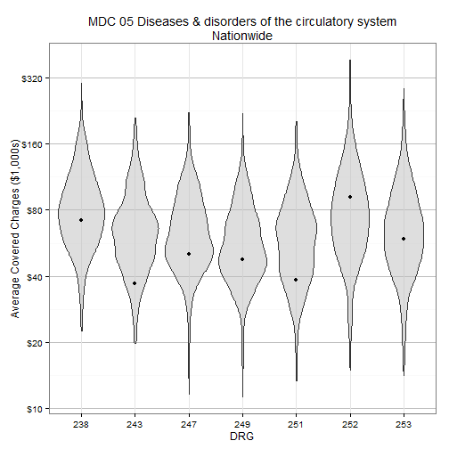 


```r
DistnPlot(dfMDC06S, "MDC 06 Diseases & disorders of the digestive system")
```

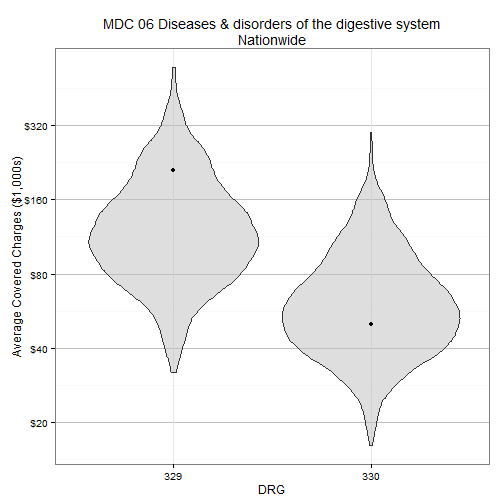 


```r
DistnPlot(dfMDC07S, "MDC 07 Diseases & disorders of the hepatobiliary system & pancreas")
```

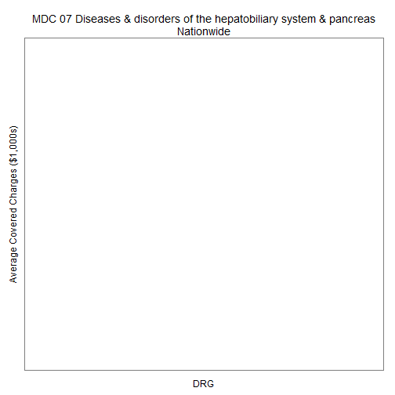 


```r
DistnPlot(dfMDC08S, "MDC 08 Diseases & disorders of the musculoskeletal system & connective tissue")
```

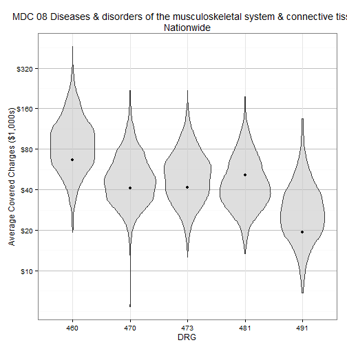 


```r
DistnPlot(dfMDC09S, "MDC 09 Diseases & disorders of the skin, subcutaneous tissue & breast")
```


```r
DistnPlot(dfMDC10S, "MDC 10 Endocrine, nutritional & metabolic diseases & disorders")
```


```r
DistnPlot(dfMDC11S, "MDC 11 Diseases & disorders of the kidney & urinary tract")
```


```r
DistnPlot(dfMDC12S, "MDC 12 Diseases & disorders of the male reproductive system")
```


```r
DistnPlot(dfMDC13S, "MDC 13 Diseases & disorders of the female reproductive system")
```


```r
DistnPlot(dfMDC14S, "MDC 14 Pregnancy, childbirth & the puerperium")
```


```r
DistnPlot(dfMDC16S, "MDC 16 Disease & disorders of blood, blood forming organs, immunologic disorders")
```


```r
DistnPlot(dfMDC17S, "MDC 17 Myeloproliferative diseases & disorders, poorly differentiated neoplasm")
```


```r
DistnPlot(dfMDC18S, "MDC 18 Infectious & parasitic diseases, systemic or unspecified sites")
```


```r
DistnPlot(dfMDC19S, "MDC 19 Mental diseases & disorders")
```


```r
DistnPlot(dfMDC20S, "MDC 20 Alcohol/drug use & alcohol/drug induced organic mental disorders")
```


```r
DistnPlot(dfMDC21S, "MDC 21 Injuries, poisonings & toxic effects of drugs")
```


```r
DistnPlot(dfMDC22S, "MDC 22 Burns")
```


```r
DistnPlot(dfMDC23S, "MDC 23 Factors influencing hlth stat & othr contacts with hlth servcs")
```


```r
DistnPlot(dfMDC24S, "MDC 24 Multiple significant trauma")
```


```r
DistnPlot(dfMDC25S, "MDC 25 Human immunodeficiency virus infections")
```


Medical DRGs
-------------
Violin plots for medical DRGs by MDC. Code chunks that are not evaluated do not have data.

```r
DistnPlot(dfMDC01M, "MDC 01 Diseases & disorders of the nervous system")
```

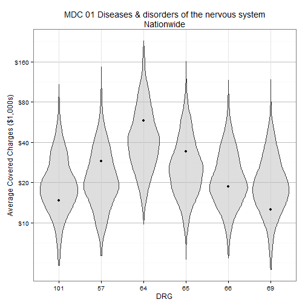 


```r
DistnPlot(dfMDC02M, "MDC 02 Diseases & disorders of the eye")
```


```r
DistnPlot(dfMDC03M, "MDC 03 Diseases & disorders of the ear, nose, mouth & throat")
```

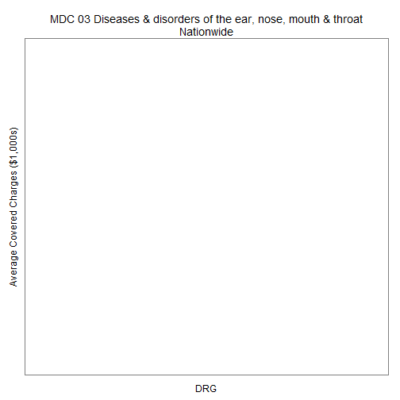 


```r
DistnPlot(dfMDC04M, "MDC 04 Diseases & disorders of the respiratory system")
```

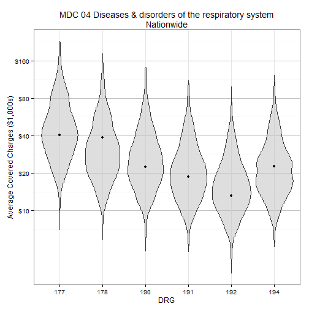 


```r
DistnPlot(dfMDC05M, "MDC 05 Diseases & disorders of the circulatory system")
```

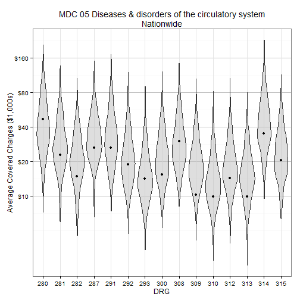 


```r
DistnPlot(dfMDC06M, "MDC 06 Diseases & disorders of the digestive system")
```

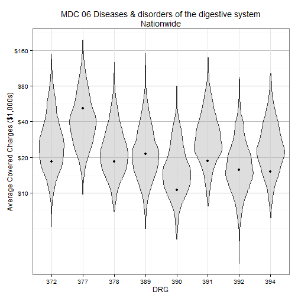 


```r
DistnPlot(dfMDC07M, "MDC 07 Diseases & disorders of the hepatobiliary system & pancreas")
```

 


```r
DistnPlot(dfMDC08M, "MDC 08 Diseases & disorders of the musculoskeletal system & connective tissue")
```

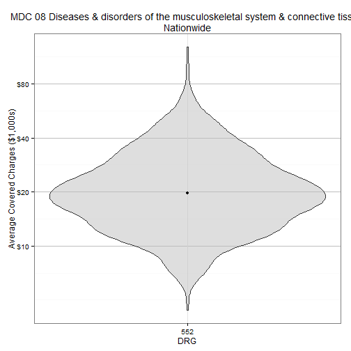 


```r
DistnPlot(dfMDC09M, "MDC 09 Diseases & disorders of the skin, subcutaneous tissue & breast")
```

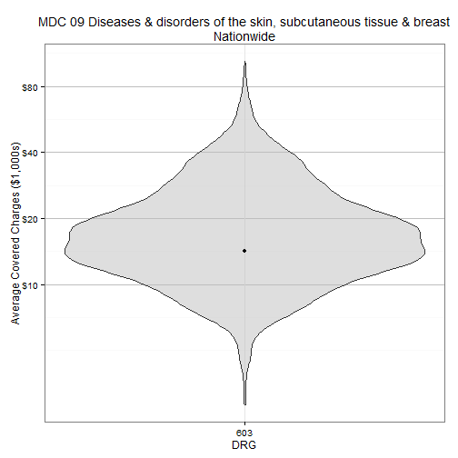 


```r
DistnPlot(dfMDC10M, "MDC 10 Endocrine, nutritional & metabolic diseases & disorders")
```

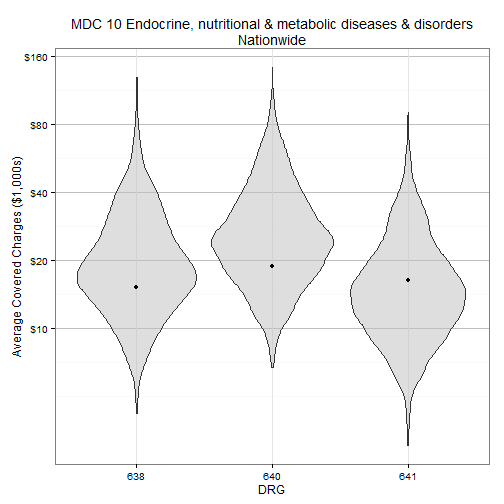 


```r
DistnPlot(dfMDC11M, "MDC 11 Diseases & disorders of the kidney & urinary tract")
```

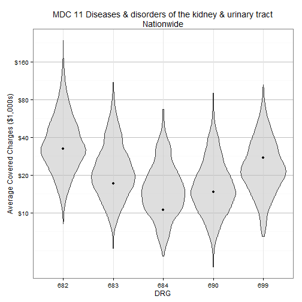 


```r
DistnPlot(dfMDC12M, "MDC 12 Diseases & disorders of the male reproductive system")
```


```r
DistnPlot(dfMDC13M, "MDC 13 Diseases & disorders of the female reproductive system")
```


```r
DistnPlot(dfMDC14M, "MDC 14 Pregnancy, childbirth & the puerperium")
```


```r
DistnPlot(dfMDC15M, "MDC 15 Newborns & other neonates with condtn orig in perinatal period")
```


```r
DistnPlot(dfMDC16M, "MDC 16 Disease & disorders of blood, blood forming organs, immunologic disorders")
```

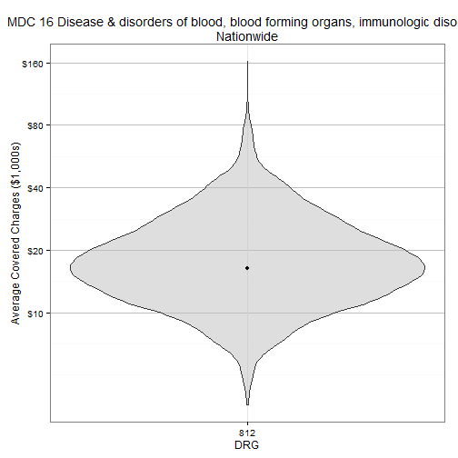 


```r
DistnPlot(dfMDC17M, "MDC 17 Myeloproliferative diseases & disorders, poorly differentiated neoplasm")
```


```r
DistnPlot(dfMDC18M, "MDC 18 Infectious & parasitic diseases, systemic or unspecified sites")
```

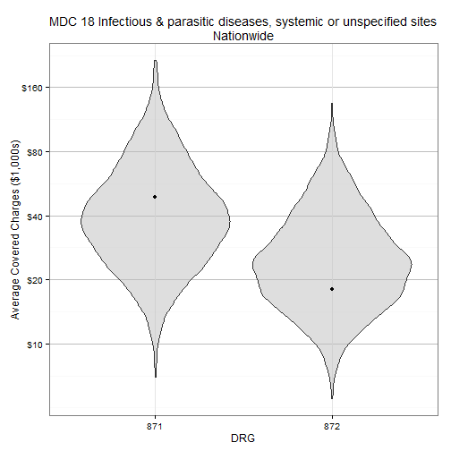 


```r
DistnPlot(dfMDC19M, "MDC 19 Mental diseases & disorders")
```

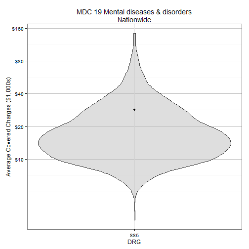 


```r
DistnPlot(dfMDC20M, "MDC 20 Alcohol/drug use & alcohol/drug induced organic mental disorders")
```

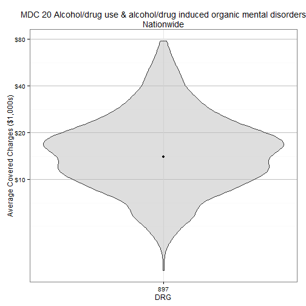 


```r
DistnPlot(dfMDC21M, "MDC 21 Injuries, poisonings & toxic effects of drugs")
```

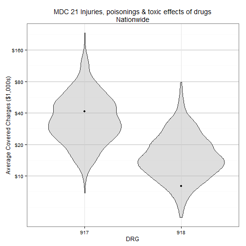 


```r
DistnPlot(dfMDC22M, "MDC 22 Burns")
```


```r
DistnPlot(dfMDC23M, "MDC 23 Factors influencing hlth stat & othr contacts with hlth servcs")
```

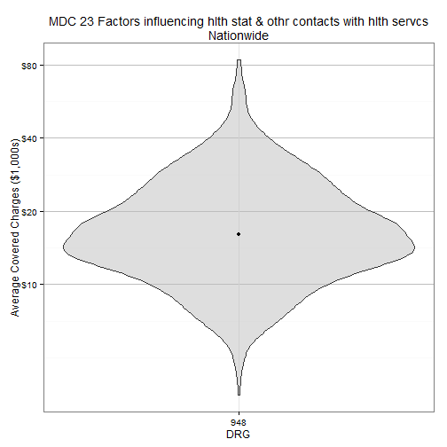 


```r
DistnPlot(dfMDC24M, "MDC 24 Multiple significant trauma")
```


```r
DistnPlot(dfMDC25M, "MDC 25 Human immunodeficiency virus infections")
```

