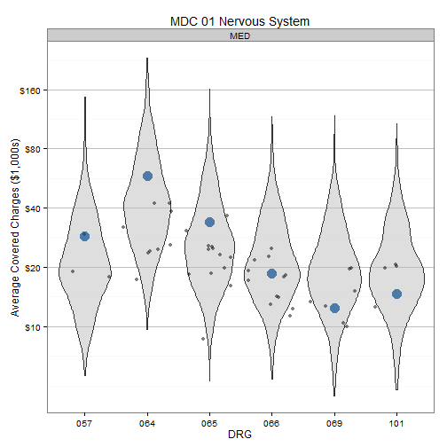
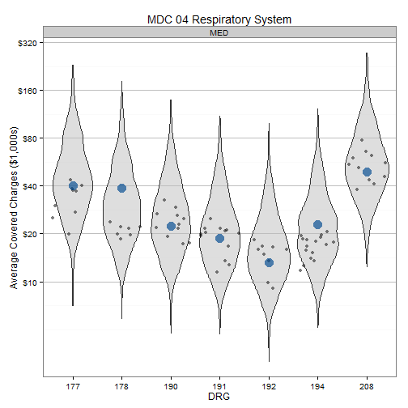
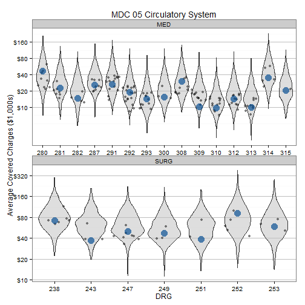
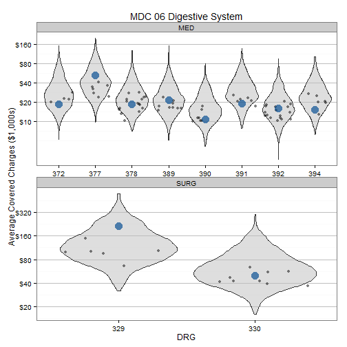
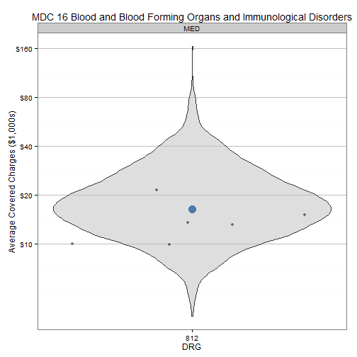
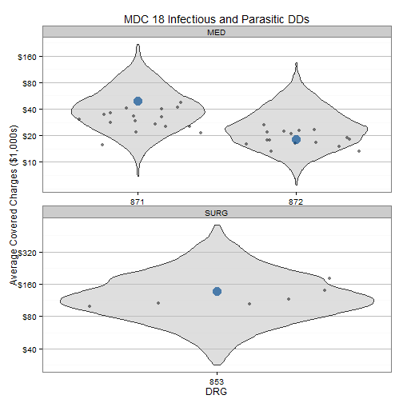
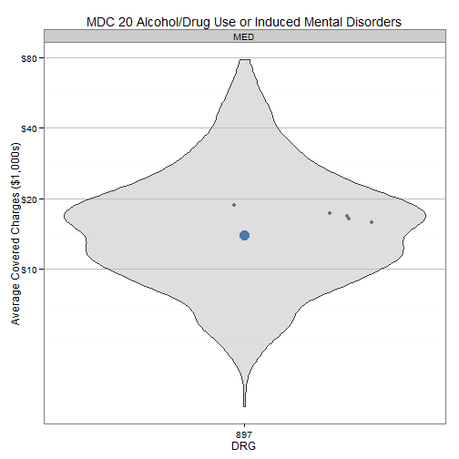
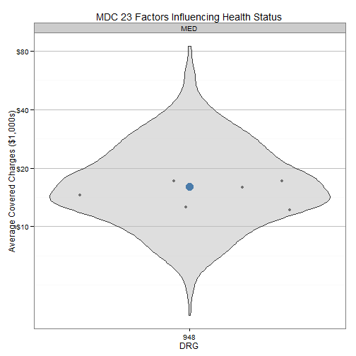

Medicare Provider Charge
========================

Last update by Benjamin Chan (<benjamin.ks.chan@gmail.com>) on 2013-05-30 12:19:24 using R version 3.0.0 (2013-04-03).

Analyze CMS Medicare Provider Charge public use dataset. The data is documented and can be downloaded at the Medicare Provider Charge Data [website](http://www.cms.gov/Research-Statistics-Data-and-Systems/Statistics-Trends-and-Reports/Medicare-Provider-Charge-Data/index.html).

> As part of the Obama administration’s work to make our health care system more affordable and accountable, data are being released that show significant variation across the country and within communities in what hospitals charge for common inpatient services.

> The data provided here include hospital-specific charges for the more than 3,000 U.S. hospitals that receive Medicare Inpatient Prospective Payment System (IPPS) payments for the top 100 most frequently billed discharges, paid under Medicare based on a rate per discharge using the Medicare Severity Diagnosis Related Group (MS-DRG) for Fiscal Year (FY) 2011. These DRGs represent almost 7 million discharges or 60 percent of total Medicare IPPS discharges.

> Hospitals determine what they will charge for items and services provided to patients and these charges are the amount the hospital bills for an item or service. The Total Payment amount includes the MS-DRG amount, bill total per diem, beneficiary primary payer claim payment amount, beneficiary Part A coinsurance amount, beneficiary deductible amount, beneficiary blood deducible amount and DRG outlier amount.

> For these DRGs, average charges and average Medicare payments are calculated at the individual hospital level. Users will be able to make comparisons between the amount charged by individual hospitals within local markets, and nationwide, for services that might be furnished in connection with a particular inpatient stay.

--------------------------------------------------------------------------------

Reading and manipulating the data
---------------------------------

Load the required libraries.

```r
require(RCurl, quietly = TRUE)
require(xtable, quietly = TRUE)
require(ggplot2, quietly = TRUE)
require(scales, quietly = TRUE)
require(RColorBrewer, quietly = TRUE)
```


RCurl with https is being tempermental. Copy the dataset to the local folder and `read.table` from there. Read the entire dataset. 

```r
# url <-
# getURL('https://dl.dropboxusercontent.com/u/386956/Medicare_Provider_Charge_Inpatient_DRG100_FY2011.csv')
# df <- read.csv(textConnection(url), header=TRUE, sep=',')
df <- read.csv("Medicare_Provider_Charge_Inpatient_DRG100_FY2011.csv", header = TRUE, 
    sep = ",")
```

Also read a MDC-DRG mapping table. This table comes from [CMS](http://www.cms.gov/Medicare/Medicare-Fee-for-Service-Payment/AcuteInpatientPPS/FY-2013-IPPS-Final-Rule-Home-Page-Items/FY2013-Final-Rule-Tables.html), [Table 5](http://www.cms.gov/Medicare/Medicare-Fee-for-Service-Payment/AcuteInpatientPPS/Downloads/FY_13_FR_Table_5.zip). Finally, create an MDC label table.

```r
drg <- read.table("CMS-1588-F TABLE 5.txt", skip = 2, nrows = 751, sep = "\t", 
    col.names = c("drg", "postacute", "specialpay", "mdc", "type", "drglab", 
        "drgwgt", "meanLOSg", "meanLOGa"))
mdc <- matrix(ncol = 2, byrow = TRUE, data = c("PRE", "Pre-MDC", "01", "Nervous System", 
    "02", "Eye", "03", "Ear, Nose, Mouth And Throat", "04", "Respiratory System", 
    "05", "Circulatory System", "06", "Digestive System", "07", "Hepatobiliary System And Pancreas", 
    "08", "Musculoskeletal System And Connective Tissue", "09", "Skin, Subcutaneous Tissue And Breast", 
    "10", "Endocrine, Nutritional And Metabolic System", "11", "Kidney And Urinary Tract", 
    "12", "Male Reproductive System", "13", "Female Reproductive System", "14", 
    "Pregnancy, Childbirth And Puerperium", "15", "Newborn And Other Neonates (Perinatal Period)", 
    "16", "Blood and Blood Forming Organs and Immunological Disorders", "17", 
    "Myeloproliferative DDs (Poorly Differentiated Neoplasms)", "18", "Infectious and Parasitic DDs", 
    "19", "Mental Diseases and Disorders", "20", "Alcohol/Drug Use or Induced Mental Disorders", 
    "21", "Injuries, Poison And Toxic Effect of Drugs", "22", "Burns", "23", 
    "Factors Influencing Health Status", "24", "Multiple Significant Trauma", 
    "25", "Human Immunodeficiency Virus Infection"), )
mdc <- data.frame(mdc)
names(mdc) <- c("mdc", "mdclab")
drg <- merge(drg, mdc, by = c("mdc"))
```


Create some new fields. 
* `DRGnum` is a numeric vector of the MS-DRG number without the description
* `DRGlab` is a character vector of the MS-DRG description without the number
* `OHSU` is a logical vector indicating if the row is from an OHSU provider

```r
df$DRGnum <- as.numeric(substr(df$DRG.Definition, 1, 3))
df$DRGchar <- substr(df$DRG.Definition, 1, 3)
df$DRGlab <- substr(df$DRG.Definition, 7, max(nchar(as.character(df$DRG.Definition))))
df$isOregon <- df$Provider.State == "OR"
df$isPDXmetro <- grepl("^OR - Portland", df$Hospital.Referral.Region.Description)
df$isOHSU <- grepl("^OHSU", df$Provider.Name)
```


Now that we have DRG in numeric form, merge the dataset to the MDC-DRG lookup.

```r
df <- merge(df, drg, by.x = c("DRGnum"), by.y = c("drg"))
```


Get vector of MS-DRGs and MDCs that OHSU has data for.

```r
drgOHSU <- as.vector(df$DRGnum[df$isOHSU])
mdcOHSU <- as.vector(unique(df$mdc[df$isOHSU]))
```


Create a subset of rows with just the DRGs in vector `drgOHSU` and non-missing DRG type.

```r
dfSubset <- subset(df, DRGnum %in% drgOHSU & !is.na(type))
```


The dataset has 163065 rows. Field names and the first few rows are below.

```r
names(df)
```

```
##  [1] "DRGnum"                              
##  [2] "DRG.Definition"                      
##  [3] "Provider.Id"                         
##  [4] "Provider.Name"                       
##  [5] "Provider.Street.Address"             
##  [6] "Provider.City"                       
##  [7] "Provider.State"                      
##  [8] "Provider.Zip.Code"                   
##  [9] "Hospital.Referral.Region.Description"
## [10] "Total.Discharges"                    
## [11] "Average.Covered.Charges"             
## [12] "Average.Total.Payments"              
## [13] "DRGchar"                             
## [14] "DRGlab"                              
## [15] "isOregon"                            
## [16] "isPDXmetro"                          
## [17] "isOHSU"                              
## [18] "mdc"                                 
## [19] "postacute"                           
## [20] "specialpay"                          
## [21] "type"                                
## [22] "drglab"                              
## [23] "drgwgt"                              
## [24] "meanLOSg"                            
## [25] "meanLOGa"                            
## [26] "mdclab"
```

```r
head(df)
```

```
##   DRGnum                           DRG.Definition Provider.Id
## 1     39 039 - EXTRACRANIAL PROCEDURES W/O CC/MCC       10001
## 2     39 039 - EXTRACRANIAL PROCEDURES W/O CC/MCC      500129
## 3     39 039 - EXTRACRANIAL PROCEDURES W/O CC/MCC       40036
## 4     39 039 - EXTRACRANIAL PROCEDURES W/O CC/MCC      250040
## 5     39 039 - EXTRACRANIAL PROCEDURES W/O CC/MCC      220171
## 6     39 039 - EXTRACRANIAL PROCEDURES W/O CC/MCC      380007
##                                     Provider.Name  Provider.Street.Address
## 1                SOUTHEAST ALABAMA MEDICAL CENTER   1108 ROSS CLARK CIRCLE
## 2               TACOMA GENERAL ALLENMORE HOSPITAL         315 S MLK JR WAY
## 3 BAPTIST HEALTH MEDICAL CENTER NORTH LITTLE ROCK    3333 SPRINGHILL DRIVE
## 4                          SINGING RIVER HOSPITAL            2809 DENNY AV
## 5                           LAHEY CLINIC HOSPITAL        41 & 45 MALL ROAD
## 6                   LEGACY EMANUEL MEDICAL CENTER 2801 N GANTENBEIN AVENUE
##     Provider.City Provider.State Provider.Zip.Code
## 1          DOTHAN             AL             36301
## 2          TACOMA             WA             98415
## 3 NORTH LITTLE RO             AR             72117
## 4      PASCAGOULA             MS             39581
## 5      BURLINGTON             MA              1803
## 6        PORTLAND             OR             97227
##   Hospital.Referral.Region.Description Total.Discharges
## 1                          AL - Dothan               91
## 2                          WA - Tacoma               15
## 3                     AR - Little Rock               35
## 4                          AL - Mobile               24
## 5                          MA - Boston               23
## 6                        OR - Portland               11
##   Average.Covered.Charges Average.Total.Payments DRGchar
## 1                   32963                   5777     039
## 2                   53322                   7739     039
## 3                   23182                   5575     039
## 4                   47045                   5768     039
## 5                   14742                   9084     039
## 6                   32728                   8428     039
##                               DRGlab isOregon isPDXmetro isOHSU mdc
## 1 EXTRACRANIAL PROCEDURES W/O CC/MCC    FALSE      FALSE  FALSE  01
## 2 EXTRACRANIAL PROCEDURES W/O CC/MCC    FALSE      FALSE  FALSE  01
## 3 EXTRACRANIAL PROCEDURES W/O CC/MCC    FALSE      FALSE  FALSE  01
## 4 EXTRACRANIAL PROCEDURES W/O CC/MCC    FALSE      FALSE  FALSE  01
## 5 EXTRACRANIAL PROCEDURES W/O CC/MCC    FALSE      FALSE  FALSE  01
## 6 EXTRACRANIAL PROCEDURES W/O CC/MCC     TRUE       TRUE  FALSE  01
##   postacute specialpay type                             drglab drgwgt
## 1        No         No SURG EXTRACRANIAL PROCEDURES W/O CC/MCC  1.028
## 2        No         No SURG EXTRACRANIAL PROCEDURES W/O CC/MCC  1.028
## 3        No         No SURG EXTRACRANIAL PROCEDURES W/O CC/MCC  1.028
## 4        No         No SURG EXTRACRANIAL PROCEDURES W/O CC/MCC  1.028
## 5        No         No SURG EXTRACRANIAL PROCEDURES W/O CC/MCC  1.028
## 6        No         No SURG EXTRACRANIAL PROCEDURES W/O CC/MCC  1.028
##   meanLOSg meanLOGa         mdclab
## 1      1.4      1.6 Nervous System
## 2      1.4      1.6 Nervous System
## 3      1.4      1.6 Nervous System
## 4      1.4      1.6 Nervous System
## 5      1.4      1.6 Nervous System
## 6      1.4      1.6 Nervous System
```


Plot the data
-------------

Create function for plotting.

```r
DistnPlot <- function(d, t) {
    ggplot(d, aes(x = DRGchar, y = Average.Covered.Charges)) + # geom_boxplot(alpha=1/2, fill='grey', outlier.size=0) +
    geom_violin(alpha = 1/2, fill = "grey") + geom_jitter(data = d[d$isPDXmetro, 
        ], alpha = 1/2, na.rm = TRUE) + geom_point(data = d[d$isOHSU, ], alpha = 2/3, 
        color = rgb(0, 73, 144, max = 255), size = 5) + facet_wrap(~type, ncol = 1, 
        scales = "free") + scale_y_log10(breaks = c(10000, 20000, 40000, 80000, 
        160000, 320000), labels = c("$10", "$20", "$40", "$80", "$160", "$320")) + 
        labs(title = t, x = "DRG", y = "Average Covered Charges ($1,000s)") + 
        theme_bw() + theme(legend.position = "bottom", panel.grid.major.x = element_blank(), 
        panel.grid.major.y = element_line(color = "grey"))
}
```


Plot each MDC. Facet by DRG type.
* Blue dot is OHSU
* Grey dots are Portland metro hospitals
* Violins represent the nationwide distribution

```r
for (i in 1:length(mdcOHSU)) {
    j <- mdcOHSU[i]
    d <- subset(dfSubset, mdc == j)
    t <- paste("MDC", mdc$mdc[mdc == j], mdc$mdclab[mdc == j])
    show(DistnPlot(d, t))
}
```

              

