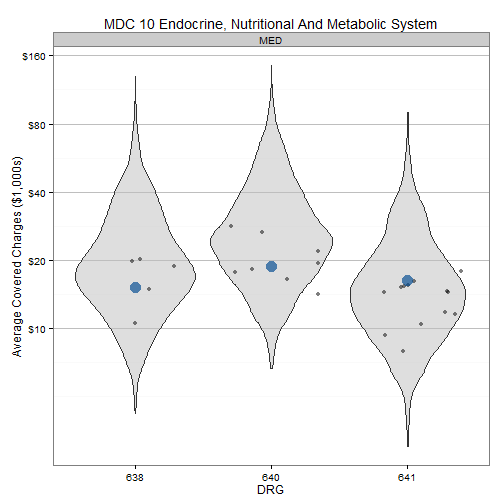
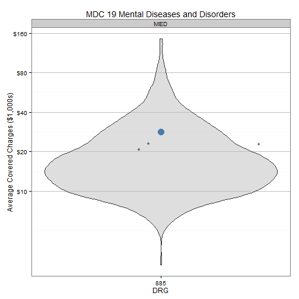
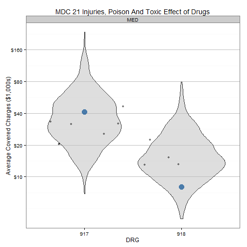

Medicare Provider Charge Data: Inpatient
========================================

Last update by Benjamin Chan (<benjamin.ks.chan@gmail.com>) on 2013-06-06 10:50:15 using R version 3.0.0 (2013-04-03).

Analyze CMS Medicare Provider Charge Data: Inpatient public use dataset. The data is documented and can be downloaded at the Medicare Provider Charge Data: Inpatient [website](http://www.cms.gov/Research-Statistics-Data-and-Systems/Statistics-Trends-and-Reports/Medicare-Provider-Charge-Data/Inpatient.html).

>The data provided here include hospital-specific charges for the more than 3,000 U.S. hospitals that receive Medicare Inpatient Prospective Payment System (IPPS) payments for the top 100 most frequently billed discharges, paid under Medicare based on a rate per discharge using the Medicare Severity Diagnosis Related Group (MS-DRG) for Fiscal Year (FY) 2011. These DRGs represent almost 7 million discharges or 60 percent of total Medicare IPPS discharges.

>Hospitals determine what they will charge for items and services provided to patients and these charges are the amount the hospital bills for an item or service. The Total Payment amount includes the MS-DRG amount, bill total per diem, beneficiary primary payer claim payment amount, beneficiary Part A coinsurance amount, beneficiary deductible amount, beneficiary blood deducible amount and DRG outlier amount.

>For these DRGs, average charges and average Medicare payments are calculated at the individual hospital level. Users will be able to make comparisons between the amount charged by individual hospitals within local markets, and nationwide, for services that might be furnished in connection with a particular inpatient stay.

--------------------------------------------------------------------------------

Reading and manipulating the data
---------------------------------

Load the required libraries.

```r
require(RCurl, quietly = TRUE)
require(xtable, quietly = TRUE)
require(ggplot2, quietly = TRUE)
require(scales, quietly = TRUE)
require(RColorBrewer, quietly = TRUE)
```


RCurl with https is being tempermental. Copy the dataset to the local folder and `read.table` from there. Read the entire dataset. 

```r
# url <-
# getURL('https://dl.dropboxusercontent.com/u/386956/Medicare_Provider_Charge_Inpatient_DRG100_FY2011.csv')
# df <- read.csv(textConnection(url), header=TRUE, sep=',')
df <- read.csv("Medicare_Provider_Charge_Inpatient_DRG100_FY2011.csv", header = TRUE, 
    sep = ",")
```


The raw data has 163065 rows. Field names and the first few rows are below.

```r
names(df)
```

```
##  [1] "DRG.Definition"                      
##  [2] "Provider.Id"                         
##  [3] "Provider.Name"                       
##  [4] "Provider.Street.Address"             
##  [5] "Provider.City"                       
##  [6] "Provider.State"                      
##  [7] "Provider.Zip.Code"                   
##  [8] "Hospital.Referral.Region.Description"
##  [9] "Total.Discharges"                    
## [10] "Average.Covered.Charges"             
## [11] "Average.Total.Payments"
```

```r
head(df)
```

```
##                                                    DRG.Definition
## 1                        039 - EXTRACRANIAL PROCEDURES W/O CC/MCC
## 2             057 - DEGENERATIVE NERVOUS SYSTEM DISORDERS W/O MCC
## 3      064 - INTRACRANIAL HEMORRHAGE OR CEREBRAL INFARCTION W MCC
## 4       065 - INTRACRANIAL HEMORRHAGE OR CEREBRAL INFARCTION W CC
## 5 066 - INTRACRANIAL HEMORRHAGE OR CEREBRAL INFARCTION W/O CC/MCC
## 6                                        069 - TRANSIENT ISCHEMIA
##   Provider.Id                    Provider.Name Provider.Street.Address
## 1       10001 SOUTHEAST ALABAMA MEDICAL CENTER  1108 ROSS CLARK CIRCLE
## 2       10001 SOUTHEAST ALABAMA MEDICAL CENTER  1108 ROSS CLARK CIRCLE
## 3       10001 SOUTHEAST ALABAMA MEDICAL CENTER  1108 ROSS CLARK CIRCLE
## 4       10001 SOUTHEAST ALABAMA MEDICAL CENTER  1108 ROSS CLARK CIRCLE
## 5       10001 SOUTHEAST ALABAMA MEDICAL CENTER  1108 ROSS CLARK CIRCLE
## 6       10001 SOUTHEAST ALABAMA MEDICAL CENTER  1108 ROSS CLARK CIRCLE
##   Provider.City Provider.State Provider.Zip.Code
## 1        DOTHAN             AL             36301
## 2        DOTHAN             AL             36301
## 3        DOTHAN             AL             36301
## 4        DOTHAN             AL             36301
## 5        DOTHAN             AL             36301
## 6        DOTHAN             AL             36301
##   Hospital.Referral.Region.Description Total.Discharges
## 1                          AL - Dothan               91
## 2                          AL - Dothan               38
## 3                          AL - Dothan               84
## 4                          AL - Dothan              169
## 5                          AL - Dothan               33
## 6                          AL - Dothan               37
##   Average.Covered.Charges Average.Total.Payments
## 1                   32963                   5777
## 2                   20313                   4895
## 3                   38820                  10260
## 4                   27345                   6542
## 5                   17606                   4596
## 6                   20689                   4134
```


Also read a MDC-DRG mapping table. This table comes from [CMS](http://www.cms.gov/Medicare/Medicare-Fee-for-Service-Payment/AcuteInpatientPPS/FY-2013-IPPS-Final-Rule-Home-Page-Items/FY2013-Final-Rule-Tables.html), [Table 5](http://www.cms.gov/Medicare/Medicare-Fee-for-Service-Payment/AcuteInpatientPPS/Downloads/FY_13_FR_Table_5.zip). Finally, create an MDC label table.

```r
drg <- read.table("CMS-1588-F TABLE 5.txt", skip=2, nrows=751, sep="\t", col.names=c("drg", "postacute", "specialpay", "mdc", "type", "drglab", "drgwgt", "meanLOSg", "meanLOGa"))
mdc <- matrix(
  ncol=2,
  byrow=TRUE,
  data=c(
"PRE", "Pre-MDC",
"01" , "Nervous System",
"02" , "Eye",
"03" , "Ear, Nose, Mouth And Throat",
"04" , "Respiratory System",
"05" , "Circulatory System",
"06" , "Digestive System",
"07" , "Hepatobiliary System And Pancreas",
"08" , "Musculoskeletal System And Connective Tissue",
"09" , "Skin, Subcutaneous Tissue And Breast",
"10" , "Endocrine, Nutritional And Metabolic System",
"11" , "Kidney And Urinary Tract",
"12" , "Male Reproductive System",
"13" , "Female Reproductive System",
"14" , "Pregnancy, Childbirth And Puerperium",
"15" , "Newborn And Other Neonates (Perinatal Period)",
"16" , "Blood and Blood Forming Organs and Immunological Disorders",
"17" , "Myeloproliferative DDs (Poorly Differentiated Neoplasms)",
"18" , "Infectious and Parasitic DDs",
"19" , "Mental Diseases and Disorders",
"20" , "Alcohol/Drug Use or Induced Mental Disorders",
"21" , "Injuries, Poison And Toxic Effect of Drugs",
"22" , "Burns",
"23" , "Factors Influencing Health Status",
"24" , "Multiple Significant Trauma",
"25" , "Human Immunodeficiency Virus Infection"
    ),
  )
mdc <- data.frame(mdc)
names(mdc) <- c("mdc", "mdclab")
drg <- merge(drg, mdc, by=c("mdc"))
```


Create some new fields. 
* `DRGnum` is a numeric vector of the MS-DRG number without the description
* `DRGchar` is a character vector of the MS-DRG number without the description
* `isOregon` is a logical vector indicating if the row is from provider in Oregon
* `isPDXmetro` is a logical vector indicating if the row is from a provider in the Portland metro hospital referral region
* `isOHSU` is a logical vector indicating if the row is from an OHSU provider

```r
df$DRGnum <- as.numeric(substr(df$DRG.Definition, 1, 3))
df$DRGchar <- substr(df$DRG.Definition, 1, 3)
df$isOregon <- df$Provider.State == "OR"
df$isPDXmetro <- grepl("^OR - Portland", df$Hospital.Referral.Region.Description)
df$isOHSU <- grepl("^OHSU", df$Provider.Name)
```


Now that we have DRG in numeric form, merge the dataset to the MDC-DRG lookup.

```r
df <- merge(df, drg, by.x = c("DRGnum"), by.y = c("drg"))
```


Get vector of MS-DRGs and MDCs that OHSU has data for.

```r
drgOHSU <- as.vector(df$DRGnum[df$isOHSU])
mdcOHSU <- as.vector(unique(df$mdc[df$isOHSU]))
```


Create a subset of rows with just the DRGs in vector `drgOHSU` and non-missing DRG type.

```r
dfSubset <- subset(df, DRGnum %in% drgOHSU & !is.na(type))
```


The subset data has 125746 rows. Field names and the first few rows are below.

```r
names(dfSubset)
```

```
##  [1] "DRGnum"                              
##  [2] "DRG.Definition"                      
##  [3] "Provider.Id"                         
##  [4] "Provider.Name"                       
##  [5] "Provider.Street.Address"             
##  [6] "Provider.City"                       
##  [7] "Provider.State"                      
##  [8] "Provider.Zip.Code"                   
##  [9] "Hospital.Referral.Region.Description"
## [10] "Total.Discharges"                    
## [11] "Average.Covered.Charges"             
## [12] "Average.Total.Payments"              
## [13] "DRGchar"                             
## [14] "isOregon"                            
## [15] "isPDXmetro"                          
## [16] "isOHSU"                              
## [17] "mdc"                                 
## [18] "postacute"                           
## [19] "specialpay"                          
## [20] "type"                                
## [21] "drglab"                              
## [22] "drgwgt"                              
## [23] "meanLOSg"                            
## [24] "meanLOGa"                            
## [25] "mdclab"
```

```r
head(dfSubset)
```

```
##      DRGnum                                      DRG.Definition
## 1080     57 057 - DEGENERATIVE NERVOUS SYSTEM DISORDERS W/O MCC
## 1081     57 057 - DEGENERATIVE NERVOUS SYSTEM DISORDERS W/O MCC
## 1082     57 057 - DEGENERATIVE NERVOUS SYSTEM DISORDERS W/O MCC
## 1083     57 057 - DEGENERATIVE NERVOUS SYSTEM DISORDERS W/O MCC
## 1084     57 057 - DEGENERATIVE NERVOUS SYSTEM DISORDERS W/O MCC
## 1085     57 057 - DEGENERATIVE NERVOUS SYSTEM DISORDERS W/O MCC
##      Provider.Id                       Provider.Name
## 1080      210057      SHADY GROVE ADVENTIST HOSPITAL
## 1081      300001                    CONCORD HOSPITAL
## 1082      310019 ST JOSEPH'S REGIONAL MEDICAL CENTER
## 1083      310017                    CHILTON HOSPITAL
## 1084      490011 BON SECOURS - DEPAUL MEDICAL CENTER
## 1085      450289     HARRIS COUNTY HOSPITAL DISTRICT
##      Provider.Street.Address  Provider.City Provider.State
## 1080     9901 MEDICAL CTR DR      ROCKVILLE             MD
## 1081         250 PLEASANT ST        CONCORD             NH
## 1082             703 MAIN ST       PATERSON             NJ
## 1083         97 WEST PARKWAY POMPTON PLAINS             NJ
## 1084       150 KINGSLEY LANE        NORFOLK             VA
## 1085         2525 HOLLY HALL        HOUSTON             TX
##      Provider.Zip.Code Hospital.Referral.Region.Description
## 1080             20850                      DC - Washington
## 1081              3301                      NH - Manchester
## 1082              7503                        NJ - Paterson
## 1083              7444                        NJ - Paterson
## 1084             23505                         VA - Norfolk
## 1085             77054                         TX - Houston
##      Total.Discharges Average.Covered.Charges Average.Total.Payments
## 1080               20                    8692                   8171
## 1081               28                   16179                   5760
## 1082               39                   80152                  11018
## 1083               36                   30019                   6248
## 1084               12                   15876                   5637
## 1085               16                   28770                   9727
##      DRGchar isOregon isPDXmetro isOHSU mdc postacute specialpay type
## 1080     057    FALSE      FALSE  FALSE  01       Yes         No  MED
## 1081     057    FALSE      FALSE  FALSE  01       Yes         No  MED
## 1082     057    FALSE      FALSE  FALSE  01       Yes         No  MED
## 1083     057    FALSE      FALSE  FALSE  01       Yes         No  MED
## 1084     057    FALSE      FALSE  FALSE  01       Yes         No  MED
## 1085     057    FALSE      FALSE  FALSE  01       Yes         No  MED
##                                             drglab drgwgt meanLOSg
## 1080 DEGENERATIVE NERVOUS SYSTEM DISORDERS W/O MCC  0.968      3.6
## 1081 DEGENERATIVE NERVOUS SYSTEM DISORDERS W/O MCC  0.968      3.6
## 1082 DEGENERATIVE NERVOUS SYSTEM DISORDERS W/O MCC  0.968      3.6
## 1083 DEGENERATIVE NERVOUS SYSTEM DISORDERS W/O MCC  0.968      3.6
## 1084 DEGENERATIVE NERVOUS SYSTEM DISORDERS W/O MCC  0.968      3.6
## 1085 DEGENERATIVE NERVOUS SYSTEM DISORDERS W/O MCC  0.968      3.6
##      meanLOGa         mdclab
## 1080      4.7 Nervous System
## 1081      4.7 Nervous System
## 1082      4.7 Nervous System
## 1083      4.7 Nervous System
## 1084      4.7 Nervous System
## 1085      4.7 Nervous System
```


Plot the data
-------------

Create function for plotting average covered charges.

```r
DistnPlot <- function(d, t) {
  ggplot(d, aes(x=DRGchar, y=Average.Covered.Charges)) +
#     geom_boxplot(alpha=1/2, fill="grey", outlier.size=0) +
    geom_violin(alpha=1/2, fill="grey") +
    geom_jitter(data=d[d$isPDXmetro & !d$isOHSU,], alpha=1/2, na.rm=TRUE) + 
    geom_point(data=d[d$isOHSU,], alpha=2/3, color=rgb(0, 73, 144, max=255), size=5) + 
    facet_wrap(~ type, ncol=1, scales="free") +
    scale_y_log10(breaks=c(1E4, 2E4, 4E4, 8E4, 16E4, 32E4), labels=c("$10", "$20", "$40", "$80", "$160", "$320")) +
    labs(title=t, x="DRG", y="Average Covered Charges ($1,000s)") +
    theme_bw() +
    theme(legend.position="bottom", panel.grid.major.x=element_blank(), panel.grid.major.y=element_line(color="grey"))
}
```


Plot each MDC. Facet by DRG type.
* Blue dot is OHSU
* Grey dots are Portland metro hospitals
* Violins represent the nationwide distribution

```r
for (i in 1:length(mdcOHSU)) {
    j <- mdcOHSU[i]
    d <- subset(dfSubset, mdc == j)
    t <- paste("MDC", mdc$mdc[mdc == j], mdc$mdclab[mdc == j])
    show(DistnPlot(d, t))
    drglab <- subset(drg, drg %in% d$DRGnum, select = c(drg, drglab))
    drglab <- drglab[order(drglab$drg), ]
    print(xtable(drglab), type = "html", include.rownames = FALSE, comment = FALSE)
}
```

 <TABLE border=1>
<TR> <TH> drg </TH> <TH> drglab </TH>  </TR>
  <TR> <TD align="right">  57 </TD> <TD> DEGENERATIVE NERVOUS SYSTEM DISORDERS W/O MCC </TD> </TR>
  <TR> <TD align="right">  64 </TD> <TD> INTRACRANIAL HEMORRHAGE OR CEREBRAL INFARCTION W MCC </TD> </TR>
  <TR> <TD align="right">  65 </TD> <TD> INTRACRANIAL HEMORRHAGE OR CEREBRAL INFARCTION W CC </TD> </TR>
  <TR> <TD align="right">  66 </TD> <TD> INTRACRANIAL HEMORRHAGE OR CEREBRAL INFARCTION W/O CC/MCC </TD> </TR>
  <TR> <TD align="right">  69 </TD> <TD> TRANSIENT ISCHEMIA </TD> </TR>
  <TR> <TD align="right"> 101 </TD> <TD> SEIZURES W/O MCC </TD> </TR>
   </TABLE>
 <TABLE border=1>
<TR> <TH> drg </TH> <TH> drglab </TH>  </TR>
  <TR> <TD align="right"> 177 </TD> <TD> RESPIRATORY INFECTIONS &amp  INFLAMMATIONS W MCC </TD> </TR>
  <TR> <TD align="right"> 178 </TD> <TD> RESPIRATORY INFECTIONS &amp  INFLAMMATIONS W CC </TD> </TR>
  <TR> <TD align="right"> 190 </TD> <TD> CHRONIC OBSTRUCTIVE PULMONARY DISEASE W MCC </TD> </TR>
  <TR> <TD align="right"> 191 </TD> <TD> CHRONIC OBSTRUCTIVE PULMONARY DISEASE W CC </TD> </TR>
  <TR> <TD align="right"> 192 </TD> <TD> CHRONIC OBSTRUCTIVE PULMONARY DISEASE W/O CC/MCC </TD> </TR>
  <TR> <TD align="right"> 194 </TD> <TD> SIMPLE PNEUMONIA &amp  PLEURISY W CC </TD> </TR>
  <TR> <TD align="right"> 208 </TD> <TD> RESPIRATORY SYSTEM DIAGNOSIS W VENTILATOR SUPPORT &lt 96 HOURS </TD> </TR>
   </TABLE>
 <TABLE border=1>
<TR> <TH> drg </TH> <TH> drglab </TH>  </TR>
  <TR> <TD align="right"> 238 </TD> <TD> MAJOR CARDIOVASC PROCEDURES W/O MCC </TD> </TR>
  <TR> <TD align="right"> 243 </TD> <TD> PERMANENT CARDIAC PACEMAKER IMPLANT W CC </TD> </TR>
  <TR> <TD align="right"> 247 </TD> <TD> PERC CARDIOVASC PROC W DRUG-ELUTING STENT W/O MCC </TD> </TR>
  <TR> <TD align="right"> 249 </TD> <TD> PERC CARDIOVASC PROC W NON-DRUG-ELUTING STENT W/O MCC </TD> </TR>
  <TR> <TD align="right"> 251 </TD> <TD> PERC CARDIOVASC PROC W/O CORONARY ARTERY STENT W/O MCC </TD> </TR>
  <TR> <TD align="right"> 252 </TD> <TD> OTHER VASCULAR PROCEDURES W MCC </TD> </TR>
  <TR> <TD align="right"> 253 </TD> <TD> OTHER VASCULAR PROCEDURES W CC </TD> </TR>
  <TR> <TD align="right"> 280 </TD> <TD> ACUTE MYOCARDIAL INFARCTION, DISCHARGED ALIVE W MCC </TD> </TR>
  <TR> <TD align="right"> 281 </TD> <TD> ACUTE MYOCARDIAL INFARCTION, DISCHARGED ALIVE W CC </TD> </TR>
  <TR> <TD align="right"> 282 </TD> <TD> ACUTE MYOCARDIAL INFARCTION, DISCHARGED ALIVE W/O CC/MCC </TD> </TR>
  <TR> <TD align="right"> 287 </TD> <TD> CIRCULATORY DISORDERS EXCEPT AMI, W CARD CATH W/O MCC </TD> </TR>
  <TR> <TD align="right"> 291 </TD> <TD> HEART FAILURE &amp  SHOCK W MCC </TD> </TR>
  <TR> <TD align="right"> 292 </TD> <TD> HEART FAILURE &amp  SHOCK W CC </TD> </TR>
  <TR> <TD align="right"> 293 </TD> <TD> HEART FAILURE &amp  SHOCK W/O CC/MCC </TD> </TR>
  <TR> <TD align="right"> 300 </TD> <TD> PERIPHERAL VASCULAR DISORDERS W CC </TD> </TR>
  <TR> <TD align="right"> 308 </TD> <TD> CARDIAC ARRHYTHMIA &amp  CONDUCTION DISORDERS W MCC </TD> </TR>
  <TR> <TD align="right"> 309 </TD> <TD> CARDIAC ARRHYTHMIA &amp  CONDUCTION DISORDERS W CC </TD> </TR>
  <TR> <TD align="right"> 310 </TD> <TD> CARDIAC ARRHYTHMIA &amp  CONDUCTION DISORDERS W/O CC/MCC </TD> </TR>
  <TR> <TD align="right"> 312 </TD> <TD> SYNCOPE &amp  COLLAPSE </TD> </TR>
  <TR> <TD align="right"> 313 </TD> <TD> CHEST PAIN </TD> </TR>
  <TR> <TD align="right"> 314 </TD> <TD> OTHER CIRCULATORY SYSTEM DIAGNOSES W MCC </TD> </TR>
  <TR> <TD align="right"> 315 </TD> <TD> OTHER CIRCULATORY SYSTEM DIAGNOSES W CC </TD> </TR>
   </TABLE>
 <TABLE border=1>
<TR> <TH> drg </TH> <TH> drglab </TH>  </TR>
  <TR> <TD align="right"> 329 </TD> <TD> MAJOR SMALL &amp  LARGE BOWEL PROCEDURES W MCC </TD> </TR>
  <TR> <TD align="right"> 330 </TD> <TD> MAJOR SMALL &amp  LARGE BOWEL PROCEDURES W CC </TD> </TR>
  <TR> <TD align="right"> 372 </TD> <TD> MAJOR GASTROINTESTINAL DISORDERS &amp  PERITONEAL INFECTIONS W CC </TD> </TR>
  <TR> <TD align="right"> 377 </TD> <TD> G.I. HEMORRHAGE W MCC </TD> </TR>
  <TR> <TD align="right"> 378 </TD> <TD> G.I. HEMORRHAGE W CC </TD> </TR>
  <TR> <TD align="right"> 389 </TD> <TD> G.I. OBSTRUCTION W CC </TD> </TR>
  <TR> <TD align="right"> 390 </TD> <TD> G.I. OBSTRUCTION W/O CC/MCC </TD> </TR>
  <TR> <TD align="right"> 391 </TD> <TD> ESOPHAGITIS, GASTROENT &amp  MISC DIGEST DISORDERS W MCC </TD> </TR>
  <TR> <TD align="right"> 392 </TD> <TD> ESOPHAGITIS, GASTROENT &amp  MISC DIGEST DISORDERS W/O MCC </TD> </TR>
  <TR> <TD align="right"> 394 </TD> <TD> OTHER DIGESTIVE SYSTEM DIAGNOSES W CC </TD> </TR>
   </TABLE>
 <TABLE border=1>
<TR> <TH> drg </TH> <TH> drglab </TH>  </TR>
  <TR> <TD align="right"> 460 </TD> <TD> SPINAL FUSION EXCEPT CERVICAL W/O MCC </TD> </TR>
  <TR> <TD align="right"> 470 </TD> <TD> MAJOR JOINT REPLACEMENT OR REATTACHMENT OF LOWER EXTREMITY W/O MCC </TD> </TR>
  <TR> <TD align="right"> 473 </TD> <TD> CERVICAL SPINAL FUSION W/O CC/MCC </TD> </TR>
  <TR> <TD align="right"> 481 </TD> <TD> HIP &amp  FEMUR PROCEDURES EXCEPT MAJOR JOINT W CC </TD> </TR>
  <TR> <TD align="right"> 491 </TD> <TD> BACK &amp  NECK PROC EXC SPINAL FUSION W/O CC/MCC </TD> </TR>
  <TR> <TD align="right"> 552 </TD> <TD> MEDICAL BACK PROBLEMS W/O MCC </TD> </TR>
   </TABLE>
 <TABLE border=1>
<TR> <TH> drg </TH> <TH> drglab </TH>  </TR>
  <TR> <TD align="right"> 603 </TD> <TD> CELLULITIS W/O MCC </TD> </TR>
   </TABLE>
 <TABLE border=1>
<TR> <TH> drg </TH> <TH> drglab </TH>  </TR>
  <TR> <TD align="right"> 638 </TD> <TD> DIABETES W CC </TD> </TR>
  <TR> <TD align="right"> 640 </TD> <TD> MISC DISORDERS OF NUTRITION,METABOLISM,FLUIDS/ELECTROLYTES W MCC </TD> </TR>
  <TR> <TD align="right"> 641 </TD> <TD> MISC DISORDERS OF NUTRITION,METABOLISM,FLUIDS/ELECTROLYTES W/O MCC </TD> </TR>
   </TABLE>
 <TABLE border=1>
<TR> <TH> drg </TH> <TH> drglab </TH>  </TR>
  <TR> <TD align="right"> 682 </TD> <TD> RENAL FAILURE W MCC </TD> </TR>
  <TR> <TD align="right"> 683 </TD> <TD> RENAL FAILURE W CC </TD> </TR>
  <TR> <TD align="right"> 684 </TD> <TD> RENAL FAILURE W/O CC/MCC </TD> </TR>
  <TR> <TD align="right"> 690 </TD> <TD> KIDNEY &amp  URINARY TRACT INFECTIONS W/O MCC </TD> </TR>
  <TR> <TD align="right"> 699 </TD> <TD> OTHER KIDNEY &amp  URINARY TRACT DIAGNOSES W CC </TD> </TR>
   </TABLE>
 <TABLE border=1>
<TR> <TH> drg </TH> <TH> drglab </TH>  </TR>
  <TR> <TD align="right"> 812 </TD> <TD> RED BLOOD CELL DISORDERS W/O MCC </TD> </TR>
   </TABLE>
 <TABLE border=1>
<TR> <TH> drg </TH> <TH> drglab </TH>  </TR>
  <TR> <TD align="right"> 853 </TD> <TD> INFECTIOUS &amp  PARASITIC DISEASES W O.R. PROCEDURE W MCC </TD> </TR>
  <TR> <TD align="right"> 871 </TD> <TD> SEPTICEMIA OR SEVERE SEPSIS W/O MV 96+ HOURS W MCC </TD> </TR>
  <TR> <TD align="right"> 872 </TD> <TD> SEPTICEMIA OR SEVERE SEPSIS W/O MV 96+ HOURS W/O MCC </TD> </TR>
   </TABLE>
 <TABLE border=1>
<TR> <TH> drg </TH> <TH> drglab </TH>  </TR>
  <TR> <TD align="right"> 885 </TD> <TD> PSYCHOSES </TD> </TR>
   </TABLE>
 <TABLE border=1>
<TR> <TH> drg </TH> <TH> drglab </TH>  </TR>
  <TR> <TD align="right"> 897 </TD> <TD> ALCOHOL/DRUG ABUSE OR DEPENDENCE W/O REHABILITATION THERAPY W/O MCC </TD> </TR>
   </TABLE>
 <TABLE border=1>
<TR> <TH> drg </TH> <TH> drglab </TH>  </TR>
  <TR> <TD align="right"> 917 </TD> <TD> POISONING &amp  TOXIC EFFECTS OF DRUGS W MCC </TD> </TR>
  <TR> <TD align="right"> 918 </TD> <TD> POISONING &amp  TOXIC EFFECTS OF DRUGS W/O MCC </TD> </TR>
   </TABLE>
 <TABLE border=1>
<TR> <TH> drg </TH> <TH> drglab </TH>  </TR>
  <TR> <TD align="right"> 948 </TD> <TD> SIGNS &amp  SYMPTOMS W/O MCC </TD> </TR>
   </TABLE>

