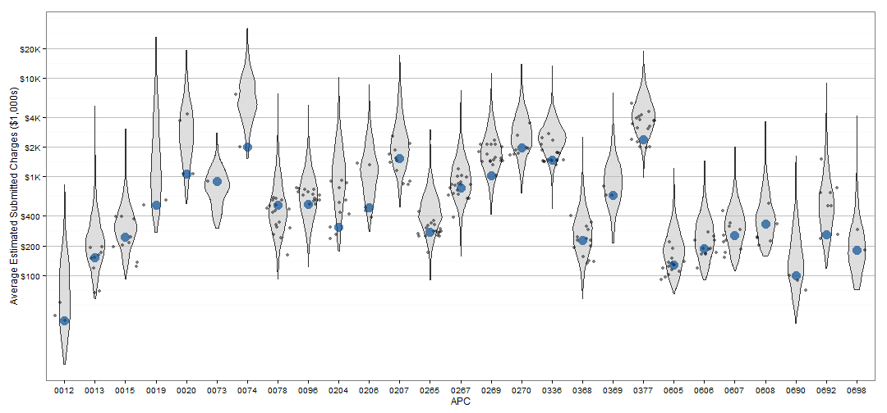

Medicare Provider Charge Data: Outpatient
========================================

Last update by Benjamin Chan (<benjamin.ks.chan@gmail.com>) on 2013-06-06 10:56:26 using R version 3.0.0 (2013-04-03).

Analyze CMS Medicare Provider Charge Data: Outpatient public use dataset. The data is documented and can be downloaded at the Medicare Provider Charge Data: Outpatient [website](http://www.cms.gov/Research-Statistics-Data-and-Systems/Statistics-Trends-and-Reports/Medicare-Provider-Charge-Data/Outpatient.html).

>The data provided here include estimated hospital-specific charges for 30 Ambulatory Payment Classification (APC) Groups paid under the Medicare Outpatient Prospective Payment System (OPPS) for Calendar Year (CY) 2011.  The Medicare payment amount includes the APC payment amount, the beneficiary Part B coinsurance amount and the beneficiary deductible amount.

>For these APCs, the estimated average charges and the average Medicare payments are provided at the individual hospital level.  The actual charges at an individual hospital for an individual service within these APC groups may differ.   For a more complete discussion of the claims criteria used in setting the Medicare payment rates for hospital outpatient services, see the Medicare CY 2013 Outpatient Prospective Payment System (OPPS) Claims Accounting document available on the CMS website at http://www.cms.gov/Medicare/Medicare-Fee-for-Service-Payment/HospitalOutpatientPPS/Downloads/CMS-1589-FC-Claims-Accounting-narrative.pdf.  This estimated outpatient charge data supplements the inpatient charge data available on the CMS Medicare Provider Charge Data Inpatient website (available via the link in the left navigation bar).

--------------------------------------------------------------------------------

Reading and manipulating the data
---------------------------------

Load the required libraries.

```r
require(RCurl, quietly = TRUE)
require(xtable, quietly = TRUE)
require(ggplot2, quietly = TRUE)
require(scales, quietly = TRUE)
require(RColorBrewer, quietly = TRUE)
```


RCurl with https is being tempermental. Copy the dataset to the local folder and `read.table` from there. Read the entire dataset. 

```r
# url <-
# getURL('https://dl.dropboxusercontent.com/u/386956/Medicare_Provider_Charge_Inpatient_DRG100_FY2011.csv')
# df <- read.csv(textConnection(url), header=TRUE, sep=',')
df <- read.csv("Medicare_Provider_Charge_Outpatient_APC30_CY2011.csv", header = TRUE, 
    sep = ",")
```


The raw data has 41175 rows. Field names and the first few rows are below.

```r
names(df)
```

```
##  [1] "APC"                                 
##  [2] "Provider.Id"                         
##  [3] "Provider.Name"                       
##  [4] "Provider.Street.Address"             
##  [5] "Provider.City"                       
##  [6] "Provider.State"                      
##  [7] "Provider.Zip.Code"                   
##  [8] "Hospital.Referral.Region.Description"
##  [9] "Outpatient.Services"                 
## [10] "Average.Estimated.Submitted.Charges" 
## [11] "Average.Total.Payments"
```

```r
head(df)
```

```
##                                        APC Provider.Id
## 1 0012 - Level I Debridement & Destruction       10029
## 2 0012 - Level I Debridement & Destruction       20024
## 3 0012 - Level I Debridement & Destruction       30064
## 4 0012 - Level I Debridement & Destruction       30088
## 5 0012 - Level I Debridement & Destruction       30111
## 6 0012 - Level I Debridement & Destruction       40016
##                                       Provider.Name
## 1               EAST ALABAMA MEDICAL CENTER AND SNF
## 2                CENTRAL PENINSULA GENERAL HOSPITAL
## 3  UNIVERSITY OF ARIZONA MEDICAL CTR-UNIVERSIT, THE
## 4                     BANNER BAYWOOD MEDICAL CENTER
## 5 UNIVERSITY OF ARIZONA MEDICAL CTR- SOUTH CAM, THE
## 6                               UAMS MEDICAL CENTER
##                  Provider.Street.Address Provider.City Provider.State
## 1                 2000 PEPPERELL PARKWAY       OPELIKA             AL
## 2                     250 HOSPITAL PLACE      SOLDOTNA             AK
## 3             1501 NORTH CAMPBELL AVENUE        TUCSON             AZ
## 4               6644 EAST BAYWOOD AVENUE          MESA             AZ
## 5                      2800 EAST AJO WAY        TUCSON             AZ
## 6 4301 WEST MARKHAM STREET MAIL SLOT 612   LITTLE ROCK             AR
##   Provider.Zip.Code Hospital.Referral.Region.Description
## 1             36801                      AL - Birmingham
## 2             99669                       AK - Anchorage
## 3             85724                          AZ - Tucson
## 4             85206                            AZ - Mesa
## 5             85713                          AZ - Tucson
## 6             72205                     AR - Little Rock
##   Outpatient.Services Average.Estimated.Submitted.Charges
## 1                  23                               78.09
## 2                 994                              149.59
## 3                1765                               50.14
## 4                  20                              112.40
## 5                  22                              152.05
## 6                3166                               58.95
##   Average.Total.Payments
## 1                  21.91
## 2                  36.62
## 3                  14.54
## 4                  23.75
## 5                  16.59
## 6                  13.57
```


Create some new fields. 
* `APCnum` is a numeric vector of the APC code without the description
* `APCchar` is a character vector of the APC code without the description
* `APCdesc` is a character vector of the APC description
* `isOregon` is a logical vector indicating if the row is from provider in Oregon
* `isPDXmetro` is a logical vector indicating if the row is from a provider in the Portland metro hospital referral region
* `isOHSU` is a logical vector indicating if the row is from an OHSU provider

```r
df$APCnum <- as.numeric(substr(df$APC, 1, 4))
df$APCchar <- substr(df$APC, 1, 4)
df$APCdesc <- substr(df$APC, 8, nchar(as.character(df$APC)))
df$isOregon <- df$Provider.State == "OR"
df$isPDXmetro <- grepl("^OR - Portland", df$Hospital.Referral.Region.Description)
df$isOHSU <- grepl("^OHSU", df$Provider.Name)
```


Get vector of APCs that OHSU has data for.

```r
apcOHSU <- as.vector(df$APCnum[df$isOHSU])
```


Build lookup table of APCs.

```r
apc <- subset(df, isOHSU, select = c(APC, APCnum, APCchar, APCdesc))
```


Create a subset of rows with just the APCs in vector `apcOHSU`.

```r
dfSubset <- subset(df, APCnum %in% apcOHSU)
```


The subset data has 39033 rows. Field names and the first few rows are below.

```r
names(dfSubset)
```

```
##  [1] "APC"                                 
##  [2] "Provider.Id"                         
##  [3] "Provider.Name"                       
##  [4] "Provider.Street.Address"             
##  [5] "Provider.City"                       
##  [6] "Provider.State"                      
##  [7] "Provider.Zip.Code"                   
##  [8] "Hospital.Referral.Region.Description"
##  [9] "Outpatient.Services"                 
## [10] "Average.Estimated.Submitted.Charges" 
## [11] "Average.Total.Payments"              
## [12] "APCnum"                              
## [13] "APCchar"                             
## [14] "APCdesc"                             
## [15] "isOregon"                            
## [16] "isPDXmetro"                          
## [17] "isOHSU"
```

```r
head(dfSubset)
```

```
##                                        APC Provider.Id
## 1 0012 - Level I Debridement & Destruction       10029
## 2 0012 - Level I Debridement & Destruction       20024
## 3 0012 - Level I Debridement & Destruction       30064
## 4 0012 - Level I Debridement & Destruction       30088
## 5 0012 - Level I Debridement & Destruction       30111
## 6 0012 - Level I Debridement & Destruction       40016
##                                       Provider.Name
## 1               EAST ALABAMA MEDICAL CENTER AND SNF
## 2                CENTRAL PENINSULA GENERAL HOSPITAL
## 3  UNIVERSITY OF ARIZONA MEDICAL CTR-UNIVERSIT, THE
## 4                     BANNER BAYWOOD MEDICAL CENTER
## 5 UNIVERSITY OF ARIZONA MEDICAL CTR- SOUTH CAM, THE
## 6                               UAMS MEDICAL CENTER
##                  Provider.Street.Address Provider.City Provider.State
## 1                 2000 PEPPERELL PARKWAY       OPELIKA             AL
## 2                     250 HOSPITAL PLACE      SOLDOTNA             AK
## 3             1501 NORTH CAMPBELL AVENUE        TUCSON             AZ
## 4               6644 EAST BAYWOOD AVENUE          MESA             AZ
## 5                      2800 EAST AJO WAY        TUCSON             AZ
## 6 4301 WEST MARKHAM STREET MAIL SLOT 612   LITTLE ROCK             AR
##   Provider.Zip.Code Hospital.Referral.Region.Description
## 1             36801                      AL - Birmingham
## 2             99669                       AK - Anchorage
## 3             85724                          AZ - Tucson
## 4             85206                            AZ - Mesa
## 5             85713                          AZ - Tucson
## 6             72205                     AR - Little Rock
##   Outpatient.Services Average.Estimated.Submitted.Charges
## 1                  23                               78.09
## 2                 994                              149.59
## 3                1765                               50.14
## 4                  20                              112.40
## 5                  22                              152.05
## 6                3166                               58.95
##   Average.Total.Payments APCnum APCchar                           APCdesc
## 1                  21.91     12    0012 Level I Debridement & Destruction
## 2                  36.62     12    0012 Level I Debridement & Destruction
## 3                  14.54     12    0012 Level I Debridement & Destruction
## 4                  23.75     12    0012 Level I Debridement & Destruction
## 5                  16.59     12    0012 Level I Debridement & Destruction
## 6                  13.57     12    0012 Level I Debridement & Destruction
##   isOregon isPDXmetro isOHSU
## 1    FALSE      FALSE  FALSE
## 2    FALSE      FALSE  FALSE
## 3    FALSE      FALSE  FALSE
## 4    FALSE      FALSE  FALSE
## 5    FALSE      FALSE  FALSE
## 6    FALSE      FALSE  FALSE
```


Plot the data
-------------

Plot each APC.
* Blue dot is OHSU
* Grey dots are Portland metro hospitals
* Violins represent the nationwide distribution

```r
ggplot(dfSubset, aes(x = APCchar, y = Average.Estimated.Submitted.Charges)) + 
    geom_violin(alpha = 1/2, fill = "grey") + geom_jitter(data = dfSubset[dfSubset$isPDXmetro, 
    ], alpha = 1/2, na.rm = TRUE) + geom_point(data = dfSubset[dfSubset$isOHSU, 
    ], alpha = 2/3, color = rgb(0, 73, 144, max = 255), size = 5) + scale_y_log10(breaks = c(100, 
    200, 400, 1000, 2000, 4000, 10000, 20000), labels = c("$100", "$200", "$400", 
    "$1K", "$2K", "$4K", "$10K", "$20K")) + labs(x = "APC", y = "Average Estimated Submitted Charges ($1,000s)") + 
    theme_bw() + theme(legend.position = "bottom", panel.grid.major.x = element_blank(), 
    panel.grid.major.y = element_line(color = "grey"))
```

 


List the APCs with their descriptions

```r
print(xtable(apc[, c("APCchar", "APCdesc")]), include.rownames = FALSE, type = "html")
```

<!-- html table generated in R 3.0.0 by xtable 1.7-1 package -->
<!-- Thu Jun 06 10:56:31 2013 -->
<TABLE border=1>
<TR> <TH> APCchar </TH> <TH> APCdesc </TH>  </TR>
  <TR> <TD> 0012 </TD> <TD> Level I Debridement &amp  Destruction </TD> </TR>
  <TR> <TD> 0013 </TD> <TD> Level II Debridement &amp  Destruction </TD> </TR>
  <TR> <TD> 0015 </TD> <TD> Level III Debridement &amp  Destruction </TD> </TR>
  <TR> <TD> 0019 </TD> <TD> Level I Excision/ Biopsy </TD> </TR>
  <TR> <TD> 0020 </TD> <TD> Level II Excision/ Biopsy </TD> </TR>
  <TR> <TD> 0073 </TD> <TD> Level III Endoscopy Upper Airway </TD> </TR>
  <TR> <TD> 0074 </TD> <TD> Level IV Endoscopy Upper Airway </TD> </TR>
  <TR> <TD> 0078 </TD> <TD> Level III Pulmonary Treatment </TD> </TR>
  <TR> <TD> 0096 </TD> <TD> Level II Noninvasive Physiologic Studies </TD> </TR>
  <TR> <TD> 0204 </TD> <TD> Level I Nerve Injections </TD> </TR>
  <TR> <TD> 0206 </TD> <TD> Level II Nerve Injections </TD> </TR>
  <TR> <TD> 0207 </TD> <TD> Level III Nerve Injections </TD> </TR>
  <TR> <TD> 0265 </TD> <TD> Level I Diagnostic and Screening Ultrasound </TD> </TR>
  <TR> <TD> 0267 </TD> <TD> Level III Diagnostic and Screening Ultrasound </TD> </TR>
  <TR> <TD> 0269 </TD> <TD> Level II Echocardiogram Without Contrast </TD> </TR>
  <TR> <TD> 0270 </TD> <TD> Level III Echocardiogram Without Contrast </TD> </TR>
  <TR> <TD> 0336 </TD> <TD> Magnetic Resonance Imaging and Magnetic Resonance Angiography without Contrast </TD> </TR>
  <TR> <TD> 0368 </TD> <TD> Level II Pulmonary Tests </TD> </TR>
  <TR> <TD> 0369 </TD> <TD> Level III Pulmonary Tests </TD> </TR>
  <TR> <TD> 0377 </TD> <TD> Level II Cardiac Imaging </TD> </TR>
  <TR> <TD> 0605 </TD> <TD> Level 2 Hospital Clinic Visits </TD> </TR>
  <TR> <TD> 0606 </TD> <TD> Level 3 Hospital Clinic Visits </TD> </TR>
  <TR> <TD> 0607 </TD> <TD> Level 4 Hospital Clinic Visits </TD> </TR>
  <TR> <TD> 0608 </TD> <TD> Level 5 Hospital Clinic Visits </TD> </TR>
  <TR> <TD> 0690 </TD> <TD> Level I Electronic Analysis of Devices </TD> </TR>
  <TR> <TD> 0692 </TD> <TD> Level II Electronic Analysis of Devices </TD> </TR>
  <TR> <TD> 0698 </TD> <TD> Level II Eye Tests &amp  Treatments </TD> </TR>
   </TABLE>

